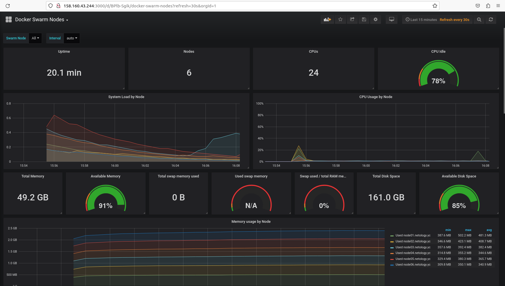

# Домашнее задание к занятию 5. «Оркестрация кластером Docker контейнеров на примере Docker Swarm»

## Как сдавать задания

Обязательны к выполнению задачи без звёздочки. Их нужно выполнить, чтобы получить зачёт и диплом о профессиональной переподготовке.

Задачи со звёдочкой (*) — это дополнительные задачи и/или задачи повышенной сложности. Их выполнять не обязательно, но они помогут вам глубже понять тему.

Домашнее задание выполните в файле readme.md в GitHub-репозитории. В личном кабинете отправьте на проверку ссылку на .md-файл в вашем репозитории.

Любые вопросы по решению задач задавайте в чате учебной группы.

---


## Важно

1. Перед отправкой работы на проверку удаляйте неиспользуемые ресурсы.
Это нужно, чтобы не расходовать средства, полученные в результате использования промокода.
Подробные рекомендации [здесь](https://github.com/netology-code/virt-homeworks/blob/virt-11/r/README.md).

2. [Ссылки для установки открытого ПО](https://github.com/netology-code/devops-materials/blob/master/README.md).

---

## Задача 1

Дайте письменые ответы на вопросы:

- В чём отличие режимов работы сервисов в Docker Swarm-кластере: replication и global?
- Какой алгоритм выбора лидера используется в Docker Swarm-кластере?
- Что такое Overlay Network?

---

**Ответ:**<br>

``` В чём отличие режимов работы сервисов в Docker Swarm кластере: replication и global? ```
Режим работы сервиса в режиме replication предполагает запуск нескольких реплик сервиса на различных узлах кластера. Количество реплик задается при создании сервиса и может быть изменено в дальнейшем. Этот режим подходит для приложений, которые могут работать в нескольких экземплярах и могут быть масштабированы горизонтально.
Режим работы сервиса в режиме global предполагает запуск одной реплики сервиса на каждом узле кластера. Такой режим подходит для приложений, которые требуют наличия только одной копии сервиса на каждом узле кластера, например, базы данных или кэш-серверы.
Таким образом, выбор режима работы сервиса зависит от конкретных потребностей приложения и требований к его масштабируемости и доступности.

``` Какой алгоритм выбора лидера используется в Docker Swarm-кластере? ```
В Docker Swarm кластере выбор лидера осуществляется с помощью алгоритма «Рафта» (Raft algorithm). Это консенсусный алгоритм распределенного управления, который используется для обеспечения надежности и отказоустойчивости в распределенных системах. 
Алгоритм «Рафта» позволяет определить один узел кластера в качестве лидера и обеспечивает перевыбор лидера в случае его отказа. При этом, кластер всегда имеет лидера, который координирует работу узлов, и принимает решения относительно выдачи задач на выполнение.

Каждый узел кластера передает сообщения другим узлам, чтобы поддерживать консенсус о текущем состоянии кластера. Если лидер перестает отвечать, кластер выбирает нового лидера, посредством голосования. По умолчанию, в качестве голосующих узлов выступают все активные узлы кластера, которые обмениваются сообщениями и принимают решения относительно перевыбора лидера.

``` Что такое Overlay Network? ```
Overlay Network - это виртуальная сеть, которая создается поверх физической сети и позволяет связывать контейнеры в разных хостах Docker Swarm кластера. Overlay Network обеспечивает изолированную среду для контейнеров, которые могут взаимодействовать друг с другом, как будто они находятся в одной локальной сети. Контейнеры в Overlay Network могут обмениваться данными и использовать сервисы, которые запущены на других узлах кластера. Overlay Network поддерживает автоматическую маршрутизацию трафика между контейнерами и позволяет управлять доступом к сети с помощью механизма аутентификации и авторизации. Это делает Overlay Network удобным инструментом для развертывания и управления микросервисами в Docker Swarm кластере.

## Задача 2

Создайте ваш первый Docker Swarm-кластер в Яндекс Облаке.

Чтобы получить зачёт, предоставьте скриншот из терминала (консоли) с выводом команды:
```
docker node ls
```

---

**Ответ:**<br>

```bash
  [root@node01 ~]# docker node ls
ID                            HOSTNAME             STATUS    AVAILABILITY   MANAGER STATUS   ENGINE VERSION
av6zgss3jfof05lkud3qcihsa *   node01.netology.yc   Ready     Active         Leader           24.0.1
pxqpri4fmlo8o422itdsrpja0     node02.netology.yc   Ready     Active         Reachable        24.0.1
s4mhq9okvw9qc7z8mkrolsg5r     node03.netology.yc   Ready     Active         Reachable        24.0.1
sg1cjph6qu657uwimea96c3l7     node04.netology.yc   Ready     Active                          24.0.1
l6yhy296sc68qrtttov3qvbv9     node05.netology.yc   Ready     Active                          24.0.1
jn6u23wb35egs9ho4y9tvvqug     node06.netology.yc   Ready     Active                          24.0.1
```

<p align="center">
  
  
</p>

<details> <summary>Детали</summary>

Правим файл `centos-7-base.json` и вписываем токены там где это требуется
Далее запускаем packer для сборки образа командой:

> packer build centos-7-base.json
>
>==> yandex: Creating image: centos-7-base
>==> yandex: Waiting for image to complete...
>==> yandex: Success image create...
>==> yandex: Destroying boot disk...
>    yandex: Disk has been deleted!
>Build 'yandex' finished after 2 minutes 8 seconds.

Проверям наличие образа в Я.Облаке и идем дальше 
Копируем в нашу директорию из задания папку `/src/*` со всем содержимым
Переходим в папку `/src/terraform` и используем команду:
```bash
/prom/05_05_docker_swarm/src/terraform#  terraform init

Initializing the backend...

Initializing provider plugins...
- Reusing previous version of yandex-cloud/yandex from the dependency lock file
- Reusing previous version of hashicorp/null from the dependency lock file
- Reusing previous version of hashicorp/local from the dependency lock file
- Using previously-installed hashicorp/null v3.2.1
- Using previously-installed hashicorp/local v2.4.0
- Using previously-installed yandex-cloud/yandex v0.91.0

Terraform has been successfully initialized!
```
Не забываем об:
>terraform providers lock -net-mirror=https://terraform-mirror.yandexcloud.net -platform=linux_amd64 -platform=darwin_arm64 yandex-cloud/yandex

В моем случае пока я не сделал мелкие изменения в конфигах провижининг не отработывал при запуске terraform apply. 
Не работал `ansible` поэтому пришлось делать некоторые изменения в файлах:

 - inventory.tf
 - node0[1-6]

Файл `inventory.tf` пришлось привести к такому виду дописав для каждого узла `ansible_port=22`
```yaml
 node01.netology.yc ansible_host=${yandex_compute_instance.node01.network_interface.0.nat_ip_address} ansible_port=22
```
В файлах конфигурации `node01-06` изменил путь до `ssh`
```yaml
...

  metadata = {
    ssh-keys = "centos:${file("~/.ssh/id_ed25519.pub")}"
  }
}
```
После чего можно использовать:
>terraform plan
>terramorf apply

```bash
Apply complete! Resources: 13 added, 0 changed, 0 destroyed.

Outputs:

external_ip_address_node01 = "158.160.43.244"
external_ip_address_node02 = "158.160.107.201"
external_ip_address_node03 = "51.250.68.104"
external_ip_address_node04 = "158.160.99.62"
external_ip_address_node05 = "62.84.124.211"
external_ip_address_node06 = "51.250.69.189"
internal_ip_address_node01 = "192.168.101.11"
internal_ip_address_node02 = "192.168.101.12"
internal_ip_address_node03 = "192.168.101.13"
internal_ip_address_node04 = "192.168.101.14"
internal_ip_address_node05 = "192.168.101.15"
internal_ip_address_node06 = "192.168.101.16"
```


</details>

## Задача 3

Создайте ваш первый, готовый к боевой эксплуатации кластер мониторинга, состоящий из стека микросервисов.

Чтобы получить зачёт, предоставьте скриншот из терминала (консоли), с выводом команды:
```
docker service ls
```

---

**Ответ:**<br>

```bash
[root@node01 ~]#  docker service ls
ID             NAME                                MODE         REPLICAS   IMAGE                                          PORTS
l95j7vekujy4   swarm_monitoring_alertmanager       replicated   1/1        stefanprodan/swarmprom-alertmanager:v0.14.0    
wtcdvq1eweyp   swarm_monitoring_caddy              replicated   1/1        stefanprodan/caddy:latest                      *:3000->3000/tcp, *:9090->9090/tcp, *:9093-9094->9093-9094/tcp
mc3f4tkpc3jv   swarm_monitoring_cadvisor           global       6/6        google/cadvisor:latest                         
aojt631npmzo   swarm_monitoring_dockerd-exporter   global       6/6        stefanprodan/caddy:latest                      
n31u0z6878yh   swarm_monitoring_grafana            replicated   1/1        stefanprodan/swarmprom-grafana:5.3.4           
mi1moghjenzk   swarm_monitoring_node-exporter      global       6/6        stefanprodan/swarmprom-node-exporter:v0.16.0   
du1iof681gjn   swarm_monitoring_prometheus         replicated   1/1        stefanprodan/swarmprom-prometheus:v2.5.0       
tlorxnkr6ifx   swarm_monitoring_unsee              replicated   1/1        cloudflare/unsee:v0.8.0   
```

<p align="center">
  
  
  
</p>


## Задача 4 (*)

Выполните на лидере Docker Swarm-кластера команду, указанную ниже, и дайте письменное описание её функционала — что она делает и зачем нужна:
```
# см.документацию: https://docs.docker.com/engine/swarm/swarm_manager_locking/
docker swarm update --autolock=true
```

---

**Ответ:**<br>

```bash
[root@node01 ~]# docker swarm update --autolock=true
Swarm updated.
To unlock a swarm manager after it restarts, run the `docker swarm unlock`
command and provide the following key:

    SWMKEY-1-y1C4...

Please remember to store this key in a password manager, since without it you
will not be able to restart the manager.
```

Команда `docker swarm update --autolock=true` включает механизм автоматической блокировки кластера Docker Swarm, который предотвращает несанкционированные изменения конфигурации кластера. Когда этот механизм включен, любые изменения в конфигурации кластера (например, добавление или удаление узлов) требуют ввода пароля для разблокировки кластера. Это повышает безопасность и защищает кластер от несанкционированных изменений.
