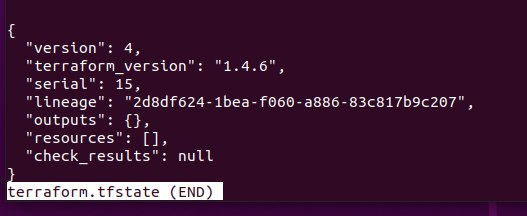

# Домашнее задание к занятию «Введение в Terraform»

### Цель задания

1. Установить и настроить Terrafrom.
2. Научиться использовать готовый код.

------

### Чеклист готовности к домашнему заданию

1. Скачайте и установите актуальную версию **terraform** >=1.4.0 . Приложите скриншот вывода команды ```terraform --version```.
2. Скачайте на свой ПК данный git репозиторий. Исходный код для выполнения задания расположен в директории **01/src**.
3. Убедитесь, что в вашей ОС установлен docker.

<details> <summary>Версия terraform</summary>

<p align="center">

</p>
</details>


------

### Инструменты и дополнительные материалы, которые пригодятся для выполнения задания

1. Установка и настройка Terraform  [ссылка](https://cloud.yandex.ru/docs/tutorials/infrastructure-management/terraform-quickstart#from-yc-mirror)
2. Зеркало документации Terraform  [ссылка](https://registry.tfpla.net/browse/providers) 
3. Установка docker [ссылка](https://docs.docker.com/engine/install/ubuntu/) 
------

### Задание 1

1. Перейдите в каталог [**src**](https://github.com/netology-code/ter-homeworks/tree/main/01/src). Скачайте все необходимые зависимости, использованные в проекте. 
2. Изучите файл **.gitignore**. В каком terraform файле согласно этому .gitignore допустимо сохранить личную, секретную информацию?
3. Выполните код проекта. Найдите  в State-файле секретное содержимое созданного ресурса **random_password**, пришлите в качестве ответа конкретный ключ и его значение.
4. Раскомментируйте блок кода, примерно расположенный на строчках 29-42 файла **main.tf**.
Выполните команду ```terraform validate```. Объясните в чем заключаются намеренно допущенные ошибки? Исправьте их.
5. Выполните код. В качестве ответа приложите вывод команды ```docker ps```
6. Замените имя docker-контейнера в блоке кода на ```hello_world```, выполните команду ```terraform apply -auto-approve```.
Объясните своими словами, в чем может быть опасность применения ключа  ```-auto-approve``` ? В качестве ответа дополнительно приложите вывод команды ```docker ps```
7. Уничтожьте созданные ресурсы с помощью **terraform**. Убедитесь, что все ресурсы удалены. Приложите содержимое файла **terraform.tfstate**. 
8. Объясните, почему при этом не был удален docker образ **nginx:latest** ? Ответ подкрепите выдержкой из документации провайдера.

---

**Ответ:**<br>

2. Изучите файл **.gitignore**. В каком terraform файле согласно этому .gitignore допустимо сохранить личную, секретную информацию?

> personal.auto.tfvars

3. Выполните код проекта. Найдите  в State-файле секретное содержимое созданного ресурса **random_password**, пришлите в качестве ответа конкретный ключ и его значение.

>"result": "p8NSK2sz66zhsKD0"

4. Раскомментируйте блок кода, примерно расположенный на строчках 29-42 файла **main.tf**.
Выполните команду ```terraform validate```. Объясните в чем заключаются намеренно допущенные ошибки? Исправьте их.

Были допущены следующие ошибки:

-Строка resource "docker_image" { не содержит "name". Сущности подобного плана должны содержать (type,name)<br>
-Строка resource "docker_container" "1nginx"  содержит "1nginx", что неверно. Допускаются только символы, а не цифры.<br>  
-Переменная ${random_password.random_string_fake.resuld}. Не объялено имя и не правильно задано поле result<br>

<details> <summary>Скриншот</summary>

<p align="center"> 

</p>
</details>

5. Выполните код. В качестве ответа приложите вывод команды ```docker ps```

<p align="center">
  
</p>

6. Замените имя docker-контейнера в блоке кода на ```hello_world```, выполните команду ```terraform apply -auto-approve```.
Объясните своими словами, в чем может быть опасность применения ключа  ```-auto-approve``` ? В качестве ответа дополнительно приложите вывод команды ```docker ps```

>Команда `terraform apply -auto-approve` автоматически применяет изменения без запроса подтверждения пользователя. Это может быть опасно, если в конфигурации есть ошибки или изменения могут привести к нежелательным последствиям. Например, это может привести к удалению важных ресурсов
<br>
<p align="center">
  
</p>

7. Уничтожьте созданные ресурсы с помощью **terraform**. Убедитесь, что все ресурсы удалены. Приложите содержимое файла **terraform.tfstate**

<p align="center">
  
</p>

8. Объясните, почему при этом не был удален docker образ **nginx:latest** ? Ответ подкрепите выдержкой из документации провайдера.

>В конфигурации использовался параметр keep_locally = true
>keep_locally (Boolean) If true, then the Docker image won't be deleted on destroy operation. If this is false, it will delete the image from the docker local storage on destroy operation.
>https://registry.terraform.io/providers/rohdealx/docker/latest/docs/resources/image


------

## Дополнительные задания (со звездочкой*)

**Настоятельно рекомендуем выполнять все задания под звёздочкой.**   Их выполнение поможет глубже разобраться в материале.   
Задания под звёздочкой дополнительные (необязательные к выполнению) и никак не повлияют на получение вами зачета по этому домашнему заданию. 

### Задание 2*

1. Изучите в документации provider [**Virtualbox**](https://registry.tfpla.net/providers/shekeriev/virtualbox/latest/docs/overview/index) от 
shekeriev.
2. Создайте с его помощью любую виртуальную машину. Чтобы не использовать VPN советуем выбрать любой образ с расположением в github из [**списка**](https://www.vagrantbox.es/)

В качестве ответа приложите plan для создаваемого ресурса и скриншот созданного в VB ресурса. 
---
**Ответ:**<br>
Пришлось помучаться с ошибкой:
```bash

│ Error: can’t create virtualbox VM debian-11: exit status 1
│
│ with virtualbox_vm.vm1,
│ on main.tf line 19, in resource “virtualbox_vm” “vm1”:
│ 19: resource “virtualbox_vm” “vm1” {

``` 
А потом еще дополнительным сюрпризом стало, что ВМ создавалась, но я ее не видел т.к. экземпляр Virtualbox был открыт из под
другого пользователя отличного от того под которым terraform создавал ВМ. Забавный момент.

<p align="center">
  
</p>


------

### Правила приема работы

Домашняя работа оформляется в отдельном GitHub репозитории в файле README.md.   
Выполненное домашнее задание пришлите ссылкой на .md-файл в вашем репозитории.

### Критерии оценки

Зачёт:

* выполнены все задания;
* ответы даны в развёрнутой форме;
* приложены соответствующие скриншоты и файлы проекта;
* в выполненных заданиях нет противоречий и нарушения логики.

На доработку:

* задание выполнено частично или не выполнено вообще;
* в логике выполнения заданий есть противоречия и существенные недостатки. 
