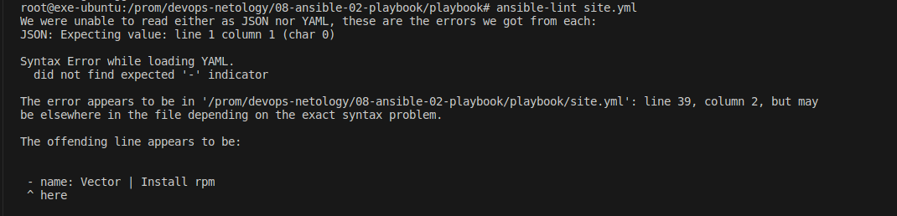
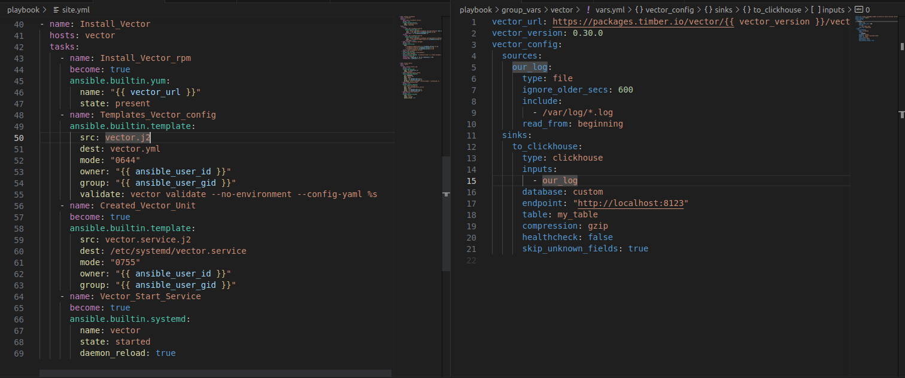
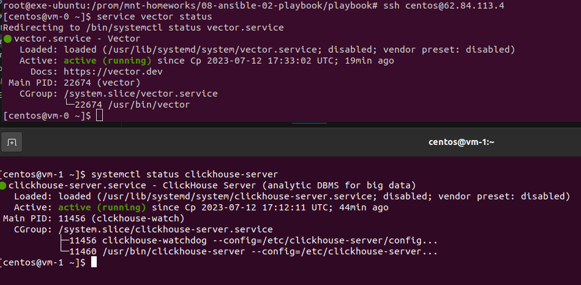

# Домашнее задание к занятию 2 «Работа с Playbook»

## Подготовка к выполнению

1. * Необязательно. Изучите, что такое [ClickHouse](https://www.youtube.com/watch?v=fjTNS2zkeBs) и [Vector](https://www.youtube.com/watch?v=CgEhyffisLY).
2. Создайте свой публичный репозиторий на GitHub с произвольным именем или используйте старый.
3. Скачайте [Playbook](./playbook/) из репозитория с домашним заданием и перенесите его в свой репозиторий.
4. Подготовьте хосты в соответствии с группами из предподготовленного playbook.


## Основная часть

1. Подготовьте свой inventory-файл `prod.yml`.

------

**Ответ:**<br>
Хосты развернул в облаке. Использовать docker не было возможности, а ставить на localhost совсем скучная затея

<p align="center">
  
</p>

Ссылка на файл с хостами:
 [prod.yml](./playbook/inventory/prod.yml)

------

2. Допишите playbook: нужно сделать ещё один play, который устанавливает и настраивает [vector](https://vector.dev).
3. При создании tasks рекомендую использовать модули: `get_url`, `template`, `unarchive`, `file`.
4. Tasks должны: скачать дистрибутив нужной версии, выполнить распаковку в выбранную директорию, установить vector.
5. Запустите `ansible-lint site.yml` и исправьте ошибки, если они есть.

**Ответ:**<br>
Проверка link. Каких либо других ошибок не встречал.

<p align="center">
  
</p>

Конфиг для установки vector

<p align="center">
  
</p>


<details> <summary>Лог отработки anisble-playbook</summary>

```bash
root@exe-ubuntu:/prom/devops-netology/08-ansible-02-playbook/playbook# ansible-playbook -i inventory/prod.yml site.yml

PLAY [Install Clickhouse] **************************************************************************************************************************************************************

TASK [Gathering Facts] *****************************************************************************************************************************************************************
ok: [vm-1]

TASK [Get clickhouse distrib] **********************************************************************************************************************************************************
ok: [vm-1] => (item=clickhouse-client)
ok: [vm-1] => (item=clickhouse-server)
failed: [vm-1] (item=clickhouse-common-static) => {"ansible_loop_var": "item", "changed": false, "dest": "./clickhouse-common-static-22.3.3.44.rpm", "elapsed": 0, "gid": 1000, "group": "centos", "item": "clickhouse-common-static", "mode": "0664", "msg": "Request failed", "owner": "centos", "response": "HTTP Error 404: Not Found", "secontext": "unconfined_u:object_r:user_home_t:s0", "size": 246310036, "state": "file", "status_code": 404, "uid": 1000, "url": "https://packages.clickhouse.com/rpm/stable/clickhouse-common-static-22.3.3.44.noarch.rpm"}

TASK [Get clickhouse distrib] **********************************************************************************************************************************************************
ok: [vm-1]

TASK [Install clickhouse packages] *****************************************************************************************************************************************************
ok: [vm-1]

TASK [Flush handlers] ******************************************************************************************************************************************************************

TASK [Create database] *****************************************************************************************************************************************************************
ok: [vm-1]

PLAY [Vector | Install rpm] ************************************************************************************************************************************************************

TASK [Gathering Facts] *****************************************************************************************************************************************************************
ok: [vm-0]

TASK [Install Vector] ******************************************************************************************************************************************************************
changed: [vm-0]

TASK [Vector | Template Config] ********************************************************************************************************************************************************
ok: [vm-0]

TASK [Vector | Create systemd unit] ****************************************************************************************************************************************************
ok: [vm-0]

TASK [Vector | Start Service] **********************************************************************************************************************************************************
ok: [vm-0]

PLAY RECAP *****************************************************************************************************************************************************************************
vm-0                       : ok=5    changed=1    unreachable=0    failed=0    skipped=0    rescued=0    ignored=0   
vm-1                       : ok=4    changed=0    unreachable=0    failed=0    skipped=0    rescued=1    ignored=0   
```
</details>

------


6. Попробуйте запустить playbook на этом окружении с флагом `--check`.

------ 

**Ответ:**<br>


<details> <summary>Лог отработки ansible-playbook -i inventory/prod.yml site.yml --check</summary>

```bash
root@exe-ubuntu:/prom/devops-netology/08-ansible-02-playbook/playbook# ansible-playbook -i inventory/prod.yml site.yml --check

PLAY [Install Clickhouse] **************************************************************************************************************************************************************

TASK [Gathering Facts] *****************************************************************************************************************************************************************
ok: [vm-1]

TASK [Get clickhouse distrib] **********************************************************************************************************************************************************
ok: [vm-1] => (item=clickhouse-client)
ok: [vm-1] => (item=clickhouse-server)
failed: [vm-1] (item=clickhouse-common-static) => {"ansible_loop_var": "item", "changed": false, "dest": "./clickhouse-common-static-22.3.3.44.rpm", "elapsed": 0, "gid": 1000, "group": "centos", "item": "clickhouse-common-static", "mode": "0664", "msg": "Request failed", "owner": "centos", "response": "HTTP Error 404: Not Found", "secontext": "unconfined_u:object_r:user_home_t:s0", "size": 246310036, "state": "file", "status_code": 404, "uid": 1000, "url": "https://packages.clickhouse.com/rpm/stable/clickhouse-common-static-22.3.3.44.noarch.rpm"}

TASK [Get clickhouse distrib] **********************************************************************************************************************************************************
ok: [vm-1]

TASK [Install clickhouse packages] *****************************************************************************************************************************************************
ok: [vm-1]

TASK [Flush handlers] ******************************************************************************************************************************************************************

TASK [Create database] *****************************************************************************************************************************************************************
skipping: [vm-1]

PLAY [Vector | Install rpm] ************************************************************************************************************************************************************

TASK [Gathering Facts] *****************************************************************************************************************************************************************
ok: [vm-0]

TASK [Install Vector] ******************************************************************************************************************************************************************
ok: [vm-0]

TASK [Vector | Template Config] ********************************************************************************************************************************************************
ok: [vm-0]

TASK [Vector | Create systemd unit] ****************************************************************************************************************************************************
ok: [vm-0]

TASK [Vector | Start Service] **********************************************************************************************************************************************************
ok: [vm-0]

PLAY RECAP *****************************************************************************************************************************************************************************
vm-0                       : ok=5    changed=0    unreachable=0    failed=0    skipped=0    rescued=0    ignored=0   
vm-1                       : ok=3    changed=0    unreachable=0    failed=0    skipped=1    rescued=1    ignored=0   
```

</details>

------

7. Запустите playbook на `prod.yml` окружении с флагом `--diff`. Убедитесь, что изменения на системе произведены.
```
ansible-playbook -i ./inventory/prod.yml site.yml --diff

changed: [vm-1]

TASK [Vector | Creating service for vector] ******************************************************************************************************************************************************
changed: [vm-1]

PLAY RECAP ***************************************************************************************************************************************************************************************
vm-0                       : ok=4    changed=1    unreachable=0    failed=0    skipped=0    rescued=1    ignored=0   
vm-1                       : ok=8    changed=7    unreachable=0    failed=0    skipped=0    rescued=0    ignored=0   

```


8. Повторно запустите playbook с флагом `--diff` и убедитесь, что playbook идемпотентен.

------ 

**Ответ:**<br>


<details> <summary>Лог отработки ansible-playbook -i inventory/prod.yml site.yml --diff</summary>

```bash
root@exe-ubuntu:/prom/devops-netology/08-ansible-02-playbook/playbook# ansible-playbook -i inventory/prod.yml site.yml --diff

PLAY [Install Clickhouse] **************************************************************************************************************************************************************

TASK [Gathering Facts] *****************************************************************************************************************************************************************
ok: [vm-1]

TASK [Get clickhouse distrib] **********************************************************************************************************************************************************
ok: [vm-1] => (item=clickhouse-client)
ok: [vm-1] => (item=clickhouse-server)
failed: [vm-1] (item=clickhouse-common-static) => {"ansible_loop_var": "item", "changed": false, "dest": "./clickhouse-common-static-22.3.3.44.rpm", "elapsed": 0, "gid": 1000, "group": "centos", "item": "clickhouse-common-static", "mode": "0664", "msg": "Request failed", "owner": "centos", "response": "HTTP Error 404: Not Found", "secontext": "unconfined_u:object_r:user_home_t:s0", "size": 246310036, "state": "file", "status_code": 404, "uid": 1000, "url": "https://packages.clickhouse.com/rpm/stable/clickhouse-common-static-22.3.3.44.noarch.rpm"}

TASK [Get clickhouse distrib] **********************************************************************************************************************************************************
ok: [vm-1]

TASK [Install clickhouse packages] *****************************************************************************************************************************************************
ok: [vm-1]

TASK [Flush handlers] ******************************************************************************************************************************************************************

TASK [Create database] *****************************************************************************************************************************************************************
ok: [vm-1]

PLAY [Install_Vector] ******************************************************************************************************************************************************************

TASK [Gathering Facts] *****************************************************************************************************************************************************************
ok: [vm-0]

TASK [Install_Vector_rpm] **************************************************************************************************************************************************************
ok: [vm-0]

TASK [Templates_Vector_config] *********************************************************************************************************************************************************
ok: [vm-0]

TASK [Created_Vector_Unit] *************************************************************************************************************************************************************
ok: [vm-0]

TASK [Vector_Start_Service] ************************************************************************************************************************************************************
ok: [vm-0]

PLAY RECAP *****************************************************************************************************************************************************************************
vm-0                       : ok=5    changed=0    unreachable=0    failed=0    skipped=0    rescued=0    ignored=0   
vm-1                       : ok=4    changed=0    unreachable=0    failed=0    skipped=0    rescued=1    ignored=0   
```
</details>


Проверка работы сервисов на VM
<p align="center">
  
</p>


9.  Подготовьте README.md-файл по своему playbook. В нём должно быть описано: что делает playbook, какие у него есть параметры и теги.

------ 

**Ответ:**<br>
Ссылка на файл README.md:<br>
 [README.md](./playbook/README.md)

------ 


10.  Готовый playbook выложите в свой репозиторий, поставьте тег `08-ansible-02-playbook` на фиксирующий коммит, в ответ предоставьте ссылку на него.
[tag](https://github.com/exesition/devops-netology/releases/tag/08-ansible-02-playbook)


### Как оформить решение задания

Выполненное домашнее задание пришлите в виде ссылки на .md-файл в вашем репозитории.

---
