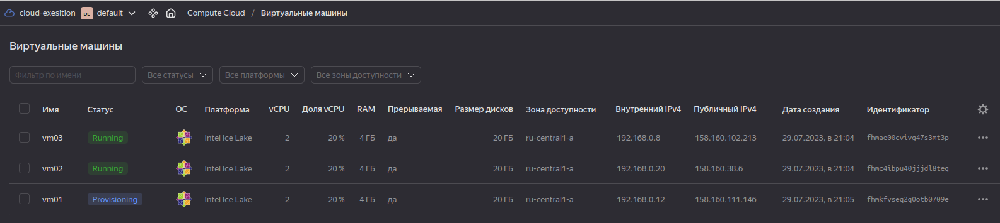
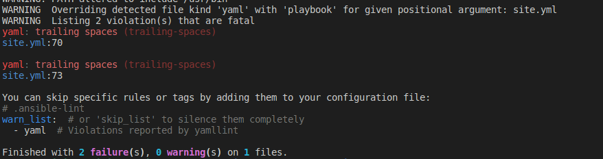
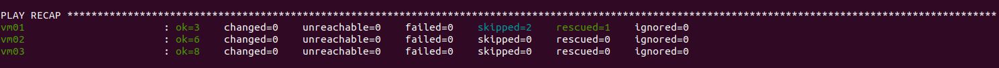
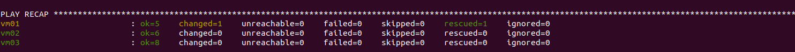
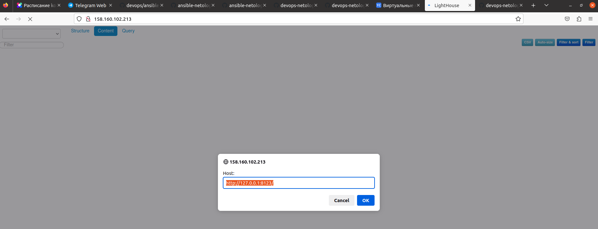
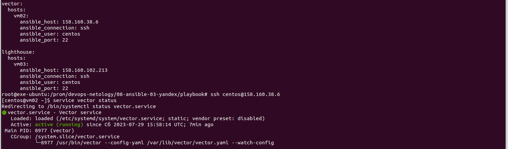

# Домашнее задание к занятию 3 «Использование Ansible»

## Подготовка к выполнению

1. Подготовьте в Yandex Cloud три хоста: для `clickhouse`, для `vector` и для `lighthouse`.
2. Репозиторий LightHouse находится [по ссылке](https://github.com/VKCOM/lighthouse).

## Основная часть

1. Допишите playbook: нужно сделать ещё один play, который устанавливает и настраивает LightHouse.
2. При создании tasks рекомендую использовать модули: `get_url`, `template`, `yum`, `apt`.
3. Tasks должны: скачать статику LightHouse, установить Nginx или любой другой веб-сервер, настроить его конфиг для открытия LightHouse, запустить веб-сервер.
4. Подготовьте свой inventory-файл `prod.yml`.
5. Запустите `ansible-lint site.yml` и исправьте ошибки, если они есть.
6. Попробуйте запустить playbook на этом окружении с флагом `--check`.
7. Запустите playbook на `prod.yml` окружении с флагом `--diff`. Убедитесь, что изменения на системе произведены.
8. Повторно запустите playbook с флагом `--diff` и убедитесь, что playbook идемпотентен.
9. Подготовьте README.md-файл по своему playbook. В нём должно быть описано: что делает playbook, какие у него есть параметры и теги.
10. Готовый playbook выложите в свой репозиторий, поставьте тег `08-ansible-03-yandex` на фиксирующий коммит, в ответ предоставьте ссылку на него.

---

### Как оформить решение задания

Выполненное домашнее задание пришлите в виде ссылки на .md-файл в вашем репозитории.

---

**Ответ:**<br>

1. Допишите playbook: нужно сделать ещё один play, который устанавливает и настраивает LightHouse.
2. При создании tasks рекомендую использовать модули: `get_url`, `template`, `yum`, `apt`.
3. Tasks должны: скачать статику LightHouse, установить Nginx или любой другой веб-сервер, настроить его конфиг для открытия LightHouse, запустить веб-сервер.

Создаем машины в облаке YC

<p align="center">
  
</p>


Ссылка на файлы lighthouse:<br>
 [lighthouse vars](./playbook/group_vars/lighthouse/vars.yml) <br>
 [lighthouse template](./playbook/templates/lighthouse.conf.j2) <br>

<details> <summary>Код в playbook для установки Lighthouse</summary>

```yaml
---
# Install/Configure Nginx
- name: Install Nginx
  tags:
    - nginx
  hosts: lighthouse
  handlers:
    - name: start-nginx
      become: true
      ansible.builtin.service:
        name: nginx
        state: restarted
      ignore_errors: "{{ ansible_check_mode }}"
  tasks:
    - name: Nginx | Install dependencies
      become: true
      ansible.builtin.yum:
        name: epel-release
        state: present
    - name: Nginx | Install nginx
      become: true
      ansible.builtin.yum:
        name: nginx
        state: latest
      ignore_errors: "{{ ansible_check_mode }}"
      notify: start-nginx
    - name: Nginx | Template config
      become: true
      ansible.builtin.template:
        src: "templates/nginx.conf.j2"
        dest: "/etc/nginx/nginx.conf"
        mode: "755"
      notify: start-nginx

# Install/Configure LightHouse
- name: Install LightHouse
  tags:
    - lighthouse
  hosts: lighthouse
  handlers:
    - name: reload-nginx
      become: true
      ansible.builtin.service:
        name: nginx
        state: reloaded
      ignore_errors: "{{ ansible_check_mode }}"
  pre_tasks:
    - name: LightHouse | Install dependencies
      become: true
      ansible.builtin.yum:
        name: git
        state: latest
  tasks:
    - name: LightHouse | Copy from git
      become: true
      git:
        repo: "{{ lighthouse_git_repo }}"
        version: master
        dest: "{{ lighthouse_location_dir }}"
      ignore_errors: "{{ ansible_check_mode }}"
    - name: LightHouse | Create config
      become: true
      ansible.builtin.template:
        src: "templates/lighthouse.conf.j2"
        dest: "/etc/nginx/conf.d/lighthouse.conf"
        mode: "755"
      notify: reload-nginx

```
</details>


4. Подготовьте свой inventory-файл `prod.yml`. <br>

[prod.yml](./playbook/inventory/prod.yml) <br>


5. Запустите `ansible-lint site.yml` и исправьте ошибки, если они есть.

При запуске команды были найдены ошибки. Исправил. <br>

<p align="center">
  
</p>


6. Попробуйте запустить playbook на этом окружении с флагом `--check`.


<p align="center">
  
</p>

<details> <summary>Листинг --check</summary>

```bash

root@exe-ubuntu:/prom/devops-netology/08-ansible-03-yandex/playbook# ansible-playbook -i inventory/prod.yml playbook.yml --check

PLAY [Install Nginx] ************************************************************************************************************************************************

TASK [Gathering Facts] **********************************************************************************************************************************************
ok: [vm03]

TASK [Nginx | Install dependencies] *********************************************************************************************************************************
ok: [vm03]

TASK [Nginx | Install nginx] ****************************************************************************************************************************************
ok: [vm03]

TASK [Nginx | Template config] **************************************************************************************************************************************
ok: [vm03]

PLAY [Install LightHouse] *******************************************************************************************************************************************

TASK [Gathering Facts] **********************************************************************************************************************************************
ok: [vm03]

TASK [LightHouse | Install dependencies] ****************************************************************************************************************************
ok: [vm03]

TASK [LightHouse | Copy from git] ***********************************************************************************************************************************
ok: [vm03]

TASK [LightHouse | Create config] ***********************************************************************************************************************************
ok: [vm03]

PLAY [Install ClickHouse] *******************************************************************************************************************************************

TASK [Gathering Facts] **********************************************************************************************************************************************
ok: [vm01]

TASK [ClickHouse | Get clickhouse distrib] **************************************************************************************************************************
ok: [vm01] => (item=clickhouse-client)
ok: [vm01] => (item=clickhouse-server)
failed: [vm01] (item=clickhouse-common-static) => {"ansible_loop_var": "item", "changed": false, "dest": "./clickhouse-common-static-22.3.3.44.rpm", "elapsed": 0, "gid": 1000, "group": "centos", "item": "clickhouse-common-static", "mode": "0664", "msg": "Request failed", "owner": "centos", "response": "HTTP Error 404: Not Found", "secontext": "unconfined_u:object_r:user_home_t:s0", "size": 246310036, "state": "file", "status_code": 404, "uid": 1000, "url": "https://packages.clickhouse.com/rpm/stable/clickhouse-common-static-22.3.3.44.noarch.rpm"}

TASK [ClickHouse | Get clickhouse distrib] **************************************************************************************************************************
ok: [vm01]

TASK [ClickHouse | Install packages] ********************************************************************************************************************************
ok: [vm01]

TASK [ClickHouse | Flush handlers] **********************************************************************************************************************************

TASK [ClickHouse | Create database] *********************************************************************************************************************************
skipping: [vm01]

TASK [Clickhouse | Create table] ************************************************************************************************************************************
skipping: [vm01]

PLAY [Install Vector] ***********************************************************************************************************************************************

TASK [Gathering Facts] **********************************************************************************************************************************************
ok: [vm02]

TASK [Vector | Download rpm] ****************************************************************************************************************************************
ok: [vm02]

TASK [Vector | Install package] *************************************************************************************************************************************
ok: [vm02]

TASK [Vector | Create data dir] *************************************************************************************************************************************
ok: [vm02]

TASK [Vector | Template config] *************************************************************************************************************************************
ok: [vm02]

TASK [Vector | Register service] ************************************************************************************************************************************
ok: [vm02]

PLAY RECAP **********************************************************************************************************************************************************
vm01                       : ok=3    changed=0    unreachable=0    failed=0    skipped=2    rescued=1    ignored=0   
vm02                       : ok=6    changed=0    unreachable=0    failed=0    skipped=0    rescued=0    ignored=0   
vm03                       : ok=8    changed=0    unreachable=0    failed=0    skipped=0    rescued=0    ignored=0

```

</details>


7. Запустите playbook на `prod.yml` окружении с флагом `--diff`. Убедитесь, что изменения на системе произведены.

<p align="center">
  
</p>


<details> <summary>Листинг --diff</summary>

```bash

root@exe-ubuntu:/prom/devops-netology/08-ansible-03-yandex/playbook# ansible-playbook -i inventory/prod.yml playbook.yml --diff

PLAY [Install Nginx] ************************************************************************************************************************************************

TASK [Gathering Facts] **********************************************************************************************************************************************
ok: [vm03]

TASK [Nginx | Install dependencies] *********************************************************************************************************************************
ok: [vm03]

TASK [Nginx | Install nginx] ****************************************************************************************************************************************
ok: [vm03]

TASK [Nginx | Template config] **************************************************************************************************************************************
ok: [vm03]

PLAY [Install LightHouse] *******************************************************************************************************************************************

TASK [Gathering Facts] **********************************************************************************************************************************************
ok: [vm03]

TASK [LightHouse | Install dependencies] ****************************************************************************************************************************
ok: [vm03]

TASK [LightHouse | Copy from git] ***********************************************************************************************************************************
ok: [vm03]

TASK [LightHouse | Create config] ***********************************************************************************************************************************
ok: [vm03]

PLAY [Install ClickHouse] *******************************************************************************************************************************************

TASK [Gathering Facts] **********************************************************************************************************************************************
ok: [vm01]

TASK [ClickHouse | Get clickhouse distrib] **************************************************************************************************************************
ok: [vm01] => (item=clickhouse-client)
ok: [vm01] => (item=clickhouse-server)
failed: [vm01] (item=clickhouse-common-static) => {"ansible_loop_var": "item", "changed": false, "dest": "./clickhouse-common-static-22.3.3.44.rpm", "elapsed": 0, "gid": 1000, "group": "centos", "item": "clickhouse-common-static", "mode": "0664", "msg": "Request failed", "owner": "centos", "response": "HTTP Error 404: Not Found", "secontext": "unconfined_u:object_r:user_home_t:s0", "size": 246310036, "state": "file", "status_code": 404, "uid": 1000, "url": "https://packages.clickhouse.com/rpm/stable/clickhouse-common-static-22.3.3.44.noarch.rpm"}

TASK [ClickHouse | Get clickhouse distrib] **************************************************************************************************************************
ok: [vm01]

TASK [ClickHouse | Install packages] ********************************************************************************************************************************
ok: [vm01]

TASK [ClickHouse | Flush handlers] **********************************************************************************************************************************

TASK [ClickHouse | Create database] *********************************************************************************************************************************
ok: [vm01]

TASK [Clickhouse | Create table] ************************************************************************************************************************************
changed: [vm01]

PLAY [Install Vector] ***********************************************************************************************************************************************

TASK [Gathering Facts] **********************************************************************************************************************************************
ok: [vm02]

TASK [Vector | Download rpm] ****************************************************************************************************************************************
ok: [vm02]

TASK [Vector | Install package] *************************************************************************************************************************************
ok: [vm02]

TASK [Vector | Create data dir] *************************************************************************************************************************************
ok: [vm02]

TASK [Vector | Template config] *************************************************************************************************************************************
ok: [vm02]

TASK [Vector | Register service] ************************************************************************************************************************************
ok: [vm02]

PLAY RECAP **********************************************************************************************************************************************************
vm01                       : ok=5    changed=1    unreachable=0    failed=0    skipped=0    rescued=1    ignored=0   
vm02                       : ok=6    changed=0    unreachable=0    failed=0    skipped=0    rescued=0    ignored=0   
vm03                       : ok=8    changed=0    unreachable=0    failed=0    skipped=0    rescued=0    ignored=0 

```

</details>


8. Повторно запустите playbook с флагом `--diff` и убедитесь, что playbook идемпотентен.
9. Подготовьте README.md-файл по своему playbook. В нём должно быть описано: что делает playbook, какие у него есть параметры и теги.

------ 


Ссылка на файл README.md:<br>
 [README.md](./playbook/group_vars/README.md)

------ 

10. Готовый playbook выложите в свой репозиторий, поставьте тег `08-ansible-03-yandex` на фиксирующий коммит, в ответ предоставьте ссылку на него.

------

[tag](https://github.com/exesition/devops-netology-hw/releases/tag/08-ansible-03-yandex)

------

## Проверка Lighthouse и Nginx


## Проверка Vector

