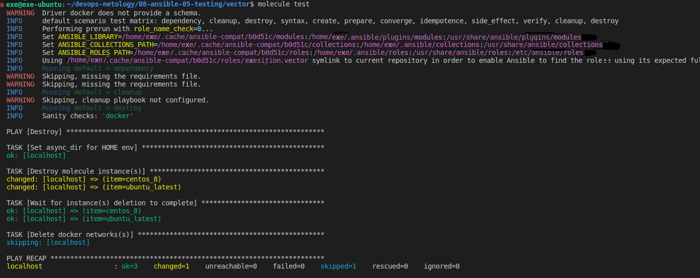
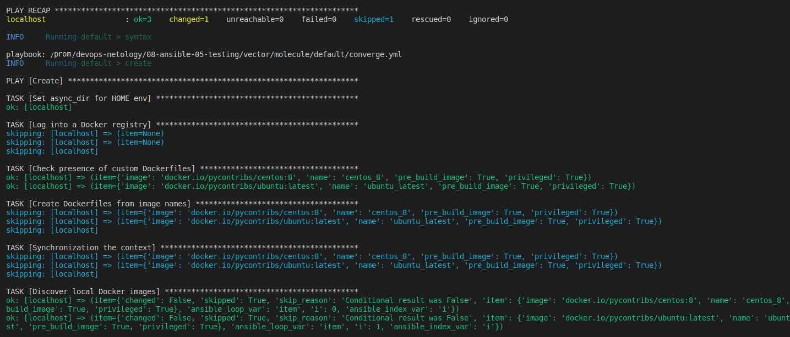
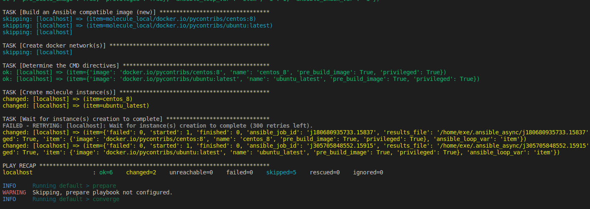
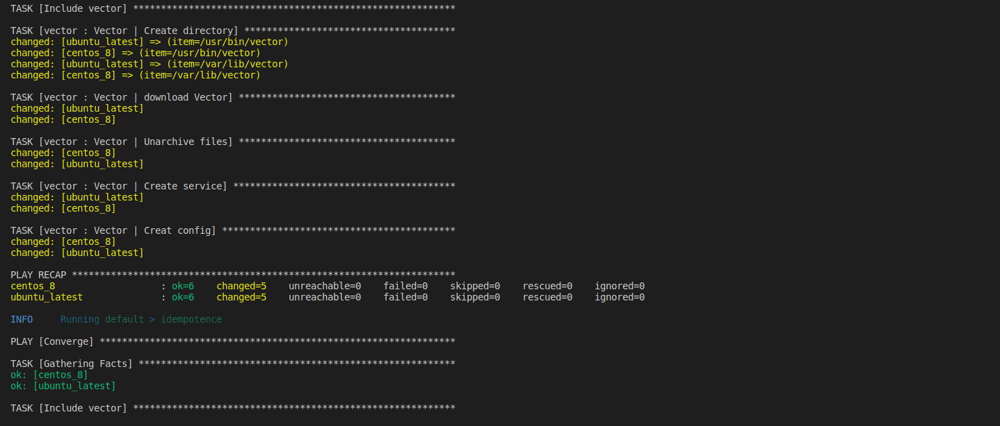
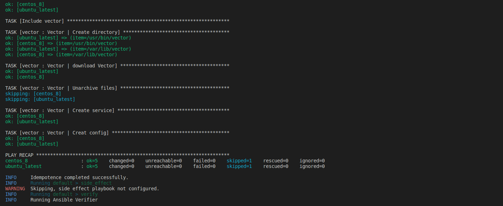
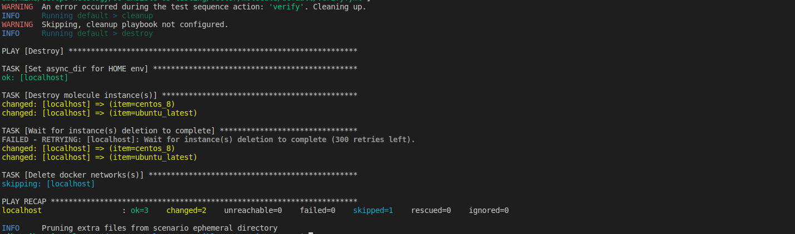
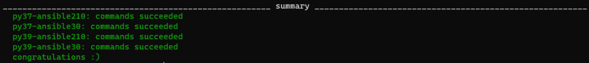

# Домашнее задание к занятию 5 «Тестирование roles»

## Подготовка к выполнению

1. Установите molecule: `pip3 install "molecule==3.5.2"`.
2. Выполните `docker pull aragast/netology:latest` —  это образ с podman, tox и несколькими пайтонами (3.7 и 3.9) внутри.

## Основная часть

Ваша цель — настроить тестирование ваших ролей. 

Задача — сделать сценарии тестирования для vector. 

Ожидаемый результат — все сценарии успешно проходят тестирование ролей.

### Molecule

1. Запустите  `molecule test -s centos_7` внутри корневой директории clickhouse-role, посмотрите на вывод команды. Данная команда может отработать с ошибками, это нормально. Наша цель - посмотреть как другие в реальном мире используют молекулу.
```
exe@exe-ubuntu:~/devops-netology/08-ansible-05-testing/ansible-clickhouse$ molecule test -s centos_7
---
dependency:
  name: galaxy
driver:
  name: docker
  options:
    D: true
    vv: true
lint: 'yamllint .

  ansible-lint

  flake8

  '
platforms:
  - capabilities:
      - SYS_ADMIN
    command: /usr/sbin/init
    dockerfile: ../resources/Dockerfile.j2
    env:
      ANSIBLE_USER: ansible
      DEPLOY_GROUP: deployer
      SUDO_GROUP: wheel
      container: docker
    image: centos:7
    name: centos_7
    privileged: true
    tmpfs:
      - /run
      - /tmp
    volumes:
      - /sys/fs/cgroup:/sys/fs/cgroup
provisioner:
  inventory:
    links:
      group_vars: ../resources/inventory/group_vars/
      host_vars: ../resources/inventory/host_vars/
      hosts: ../resources/inventory/hosts.yml
  name: ansible
  options:
    D: true
    vv: true
  playbooks:
    converge: ../resources/playbooks/converge.yml
verifier:
  name: ansible
  playbooks:
    verify: ../resources/tests/verify.yml

CRITICAL Failed to pre-validate.

{'driver': [{'name': ['unallowed value docker']}]}
```
2. Перейдите в каталог с ролью vector-role и создайте сценарий тестирования по умолчанию при помощи `molecule init scenario --driver-name docker`.
```
Перед этим установил pip3 install molecule_docker molecule_podman
exe@exe-ubuntu:~/devops-netology/08-ansible-05-testing/vector$ molecule init scenario --driver-name docker 
INFO     Initializing new scenario default...
INFO     Initialized scenario in /prom/devops-netology/08-ansible-05-testing/vector/molecule/default successfully

```
3. Добавьте несколько разных дистрибутивов (centos:8, ubuntu:latest) для инстансов и протестируйте роль, исправьте найденные ошибки, если они есть.
```
platforms:
  - name: centos_8
    image: docker.io/pycontribs/centos:8
    pre_build_image: true
  - name: ubuntu_latest
    image: docker.io/pycontribs/ubuntu:latest
    pre_build_image: true
```
4. Добавьте несколько assert в verify.yml-файл для  проверки работоспособности vector-role (проверка, что конфиг валидный, проверка успешности запуска и др.). 
```
- name: Verify
  hosts: all
  gather_facts: false
  tasks:
    - name: check vector service started
      ansible.builtin.service:
        name: vector
        state: started
```
5. Запустите тестирование роли повторно и проверьте, что оно прошло успешно.
<p align="center">
  
</p>
<p align="center">
  
</p>
<p align="center">
  
</p>
<p align="center">
  
</p>
<p align="center">
  
</p>
<p align="center">
  
</p>

6. Добавьте новый тег на коммит с рабочим сценарием в соответствии с семантическим версионированием.

[vector-role version 1.0.0](https://github.com/exesition/vector-role/releases/tag/v1.0.0)
### Tox

1. Добавьте в директорию с vector-role файлы из [директории](./example).
2. Запустите `docker run --privileged=True -v <path_to_repo>:/opt/vector-role -w /opt/vector-role -it aragast/netology:latest /bin/bash`, где path_to_repo — путь до корня репозитория с vector-role на вашей файловой системе.
3. Внутри контейнера выполните команду `tox`, посмотрите на вывод.
4. Создайте облегчённый сценарий для `molecule` с драйвером `molecule_podman`. Проверьте его на исполнимость.
5. Пропишите правильную команду в `tox.ini`, чтобы запускался облегчённый сценарий.
6. Запустите команду `tox`. Убедитесь, что всё отработало успешно.
7. Добавьте новый тег на коммит с рабочим сценарием в соответствии с семантическим версионированием.

```
[root@133ed316greh vector-role]# tox
py37-ansible210 installed: ansible==2.10.7,ansible-base==2.10.17,ansible-compat==1.0.0,ansible-lint==5.1.3,arrow==1.2.3,bcrypt==4.0.1,binaryornot==0.4.4,bracex==2.3.post1,cached-property==1.5.2,Cerberus==1.3.5,certifi==2023.7.22,cffi==1.15.1,chardet==5.2.0,charset-normalizer==3.2.0,click==8.1.7,click-help-colors==0.9.2,cookiecutter==2.3.1,cryptography==41.0.4,distro==1.8.0,enrich==1.2.7,idna==3.4,importlib-metadata==6.7.0,Jinja2==3.1.2,jmespath==1.0.1,lxml==4.9.3,markdown-it-py==2.2.0,MarkupSafe==2.1.3,mdurl==0.1.2,molecule==3.5.2,molecule-podman==1.1.0,packaging==23.1,paramiko==2.12.0,pathspec==0.11.2,pluggy==1.2.0,pycparser==2.21,Pygments==2.16.1,PyNaCl==1.5.0,python-dateutil==2.8.2,python-slugify==8.0.1,PyYAML==5.4.1,requests==2.31.0,rich==13.5.3,ruamel.yaml==0.17.32,ruamel.yaml.clib==0.2.7,selinux==0.2.1,six==1.16.0,subprocess-tee==0.3.5,tenacity==8.2.3,text-unidecode==1.3,typing_extensions==4.7.1,urllib3==2.0.5,wcmatch==8.4.1,yamllint==1.26.3,zipp==3.15.0
py37-ansible210 run-test-pre: PYTHONHASHSEED='3806544882'
py37-ansible210 run-test: commands[0] | molecule test -s tox --destroy always
INFO     tox scenario test matrix: destroy, create, converge, destroy
INFO     Performing prerun...
INFO     Set ANSIBLE_LIBRARY=/root/.cache/ansible-compat/b984a4/modules:/root/.ansible/plugins/modules:/usr/share/ansible/plugins/modules
INFO     Set ANSIBLE_COLLECTIONS_PATH=/root/.cache/ansible-compat/b984a4/collections:/root/.ansible/collections:/usr/share/ansible/collections
INFO     Set ANSIBLE_ROLES_PATH=/root/.cache/ansible-compat/b984a4/roles:/root/.ansible/roles:/usr/share/ansible/roles:/etc/ansible/roles
INFO     Running tox > destroy
INFO     Sanity checks: 'podman'
...

...

PLAY RECAP *********************************************************************
localhost                  : ok=1    changed=0    unreachable=0    failed=0    skipped=1    rescued=0    ignored=0

INFO     Pruning extra files from scenario ephemeral directory
__________________________________________________________ summary ___________________________________________________________
  py37-ansible210: commands succeeded
  py37-ansible30: commands succeeded
  py37-ansible210: commands succeeded
  py37-ansible30: commands succeeded
  congratulations :)

```

<p align="center">
  
</p>

После выполнения у вас должно получится два сценария molecule и один tox.ini файл в репозитории. Не забудьте указать в ответе теги решений Tox и Molecule заданий. В качестве решения пришлите ссылку на  ваш репозиторий и скриншоты этапов выполнения задания. 

[vector-role version 1.0.1](https://github.com/exesition/vector-role/releases/tag/v1.0.1)

## Необязательная часть

1. Проделайте схожие манипуляции для создания роли LightHouse.
2. Создайте сценарий внутри любой из своих ролей, который умеет поднимать весь стек при помощи всех ролей.
3. Убедитесь в работоспособности своего стека. Создайте отдельный verify.yml, который будет проверять работоспособность интеграции всех инструментов между ними.
4. Выложите свои roles в репозитории.

В качестве решения пришлите ссылки и скриншоты этапов выполнения задания.

---

### Как оформить решение задания

Выполненное домашнее задание пришлите в виде ссылки на .md-файл в вашем репозитории.
