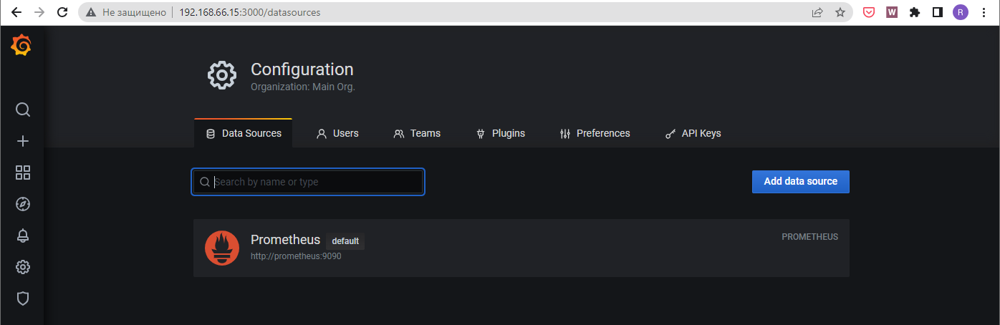
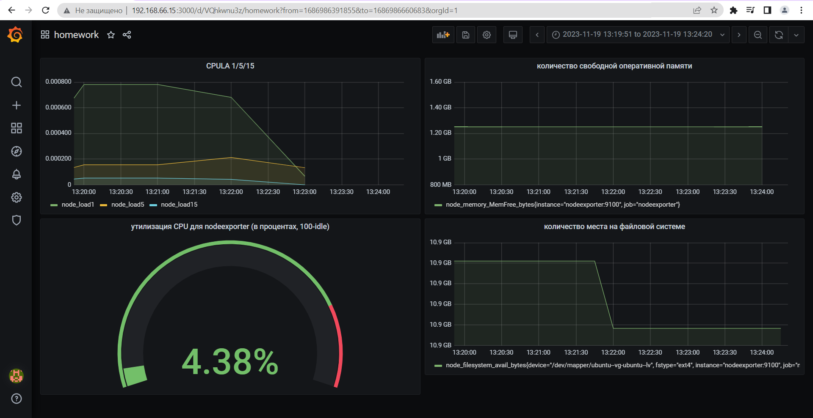
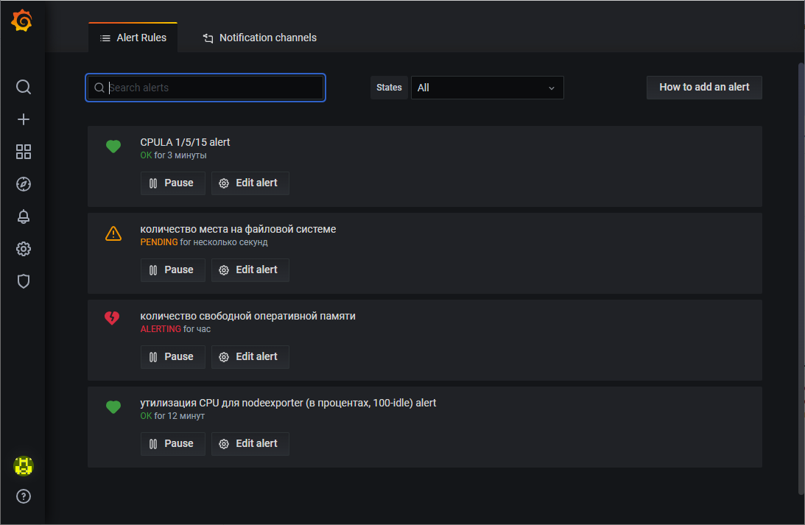
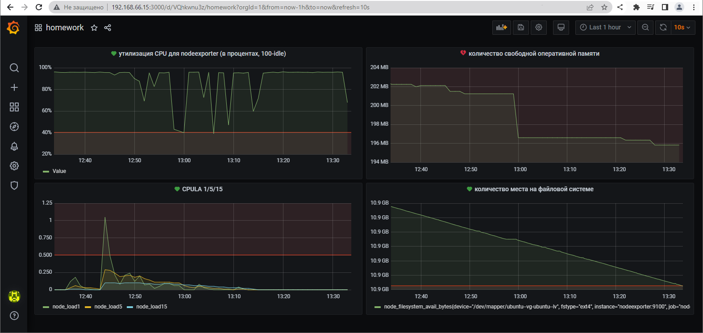

# Домашнее задание к занятию 14 «Средство визуализации Grafana»

## Задание повышенной сложности

**При решении задания 1** не используйте директорию [help](./help) для сборки проекта. Самостоятельно разверните grafana, где в роли источника данных будет выступать prometheus, а сборщиком данных будет node-exporter:

- grafana;
- prometheus-server;
- prometheus node-exporter.

За дополнительными материалами можете обратиться в официальную документацию grafana и prometheus.

В решении к домашнему заданию также приведите все конфигурации, скрипты, манифесты, которые вы 
использовали в процессе решения задания.

**При решении задания 3** вы должны самостоятельно завести удобный для вас канал нотификации, например, Telegram или email, и отправить туда тестовые события.

В решении приведите скриншоты тестовых событий из каналов нотификаций.

## Обязательные задания

### Задание 1

1. Используя директорию [help](./help) внутри этого домашнего задания, запустите связку prometheus-grafana.
1. Зайдите в веб-интерфейс grafana, используя авторизационные данные, указанные в манифесте docker-compose.
1. Подключите поднятый вами prometheus, как источник данных.
1. Решение домашнего задания — скриншот веб-интерфейса grafana со списком подключенных Datasource.


---

**Ответ:**<br>

<p align="center">
  
</p>

---

## Задание 2

Изучите самостоятельно ресурсы:

1. [PromQL tutorial for beginners and humans](https://valyala.medium.com/promql-tutorial-for-beginners-9ab455142085).
1. [Understanding Machine CPU usage](https://www.robustperception.io/understanding-machine-cpu-usage).
1. [Introduction to PromQL, the Prometheus query language](https://grafana.com/blog/2020/02/04/introduction-to-promql-the-prometheus-query-language/).

Создайте Dashboard и в ней создайте Panels:

- утилизация CPU для nodeexporter (в процентах, 100-idle);
- CPULA 1/5/15;
- количество свободной оперативной памяти;
- количество места на файловой системе.

Для решения этого задания приведите promql-запросы для выдачи этих метрик, а также скриншот получившейся Dashboard.

---

**Ответ:**<br>

- Утилизация CPU для nodeexporter (в процентах, 100-idle)

    ```
    avg by(instance)(rate(node_cpu_seconds_total{job="node_exporter",mode="idle"}[$__rate_interval])) * 100
    ```

- CPULA 1/5/15

    ```
    avg by (instance)(rate(node_load1{}[$__rate_interval]))
    avg by (instance)(rate(node_load5{}[$__rate_interval]))
    avg by (instance)(rate(node_load15{}[$__rate_interval]))

    ```

- Количество свободной оперативной памяти

    ```
    avg(node_memory_MemFree_bytes{instance="nodeexporter:9100",job="node_exporter"})
    avg(node_memory_MemAvailable_bytes{instance="nodeexporter:9100", job="node_exporter"})
    ```

- Количество места на файловой системе

    ```
    node_filesystem_free_bytes{fstype="ext4",instance="nodeexporter:9100",job="node_exporter"}
    ```

Cкрин дашборда с PromQL запросами выше
<p align="center">
  
</p>

---


## Задание 3

1. Создайте для каждой Dashboard подходящее правило alert — можно обратиться к первой лекции в блоке «Мониторинг».
1. В качестве решения задания приведите скриншот вашей итоговой Dashboard.

---

**Ответ:**<br>

<p align="center">
  
</p>
<p align="center">
  
</p>

---

## Задание 4

1. Сохраните ваш Dashboard.Для этого перейдите в настройки Dashboard, выберите в боковом меню «JSON MODEL». Далее скопируйте отображаемое json-содержимое в отдельный файл и сохраните его.
1. В качестве решения задания приведите листинг этого файла.

---

**Ответ:**<br>


```yaml

{
    "annotations": {
      "list": [
        {
          "builtIn": 1,
          "datasource": "Prometheus",
          "enable": true,
          "hide": true,
          "iconColor": "rgba(0, 211, 255, 1)",
          "limit": 100,
          "name": "Annotations & Alerts",
          "showIn": 0,
          "type": "dashboard"
        }
      ]
    },
    "editable": true,
    "gnetId": null,
    "graphTooltip": 0,
    "id": 1,
    "links": [],
    "panels": [
      {
        "alert": {
          "alertRuleTags": {},
          "conditions": [
            {
              "evaluator": {
                "params": [
                  40
                ],
                "type": "lt"
              },
              "operator": {
                "type": "and"
              },
              "query": {
                "params": [
                  "A",
                  "1m",
                  "now"
                ]
              },
              "reducer": {
                "params": [],
                "type": "last"
              },
              "type": "query"
            }
          ],
          "executionErrorState": "alerting",
          "for": "2m",
          "frequency": "1m",
          "handler": 1,
          "message": "hiload",
          "name": "утилизация CPU для nodeexporter (в процентах, 100-idle) alert",
          "noDataState": "no_data",
          "notifications": []
        },
        "aliasColors": {},
        "bars": false,
        "dashLength": 10,
        "dashes": false,
        "datasource": null,
        "fieldConfig": {
          "defaults": {
            "custom": {},
            "unit": "percent"
          },
          "overrides": []
        },
        "fill": 1,
        "fillGradient": 0,
        "gridPos": {
          "h": 8,
          "w": 12,
          "x": 0,
          "y": 0
        },
        "hiddenSeries": false,
        "id": 10,
        "interval": null,
        "legend": {
          "avg": false,
          "current": false,
          "max": false,
          "min": false,
          "show": true,
          "total": false,
          "values": false
        },
        "lines": true,
        "linewidth": 1,
        "nullPointMode": "null",
        "options": {
          "alertThreshold": true
        },
        "percentage": false,
        "pluginVersion": "7.4.0",
        "pointradius": 2,
        "points": false,
        "renderer": "flot",
        "seriesOverrides": [],
        "spaceLength": 10,
        "stack": false,
        "steppedLine": false,
        "targets": [
          {
            "expr": "(avg by (instance) (rate(node_cpu_seconds_total{job='nodeexporter',mode='idle'}[1m])) * 100)",
            "format": "table",
            "hide": false,
            "interval": "1m",
            "intervalFactor": 1,
            "legendFormat": "",
            "refId": "A"
          }
        ],
        "thresholds": [
          {
            "colorMode": "critical",
            "fill": true,
            "line": true,
            "op": "lt",
            "value": 40,
            "visible": true
          }
        ],
        "timeFrom": null,
        "timeRegions": [],
        "timeShift": null,
        "title": "утилизация CPU для nodeexporter (в процентах, 100-idle)",
        "tooltip": {
          "shared": true,
          "sort": 0,
          "value_type": "individual"
        },
        "type": "graph",
        "xaxis": {
          "buckets": null,
          "mode": "time",
          "name": null,
          "show": true,
          "values": []
        },
        "yaxes": [
          {
            "format": "percent",
            "label": null,
            "logBase": 1,
            "max": null,
            "min": null,
            "show": true
          },
          {
            "format": "short",
            "label": null,
            "logBase": 1,
            "max": null,
            "min": null,
            "show": true
          }
        ],
        "yaxis": {
          "align": false,
          "alignLevel": null
        }
      },
      {
        "alert": {
          "alertRuleTags": {},
          "conditions": [
            {
              "evaluator": {
                "params": [
                  232919255
                ],
                "type": "lt"
              },
              "operator": {
                "type": "and"
              },
              "query": {
                "params": [
                  "A",
                  "1m",
                  "now"
                ]
              },
              "reducer": {
                "params": [],
                "type": "avg"
              },
              "type": "query"
            }
          ],
          "executionErrorState": "keep_state",
          "for": "2m",
          "frequency": "1m",
          "handler": 1,
          "message": "Memory low",
          "name": "количество свободной оперативной памяти",
          "noDataState": "no_data",
          "notifications": []
        },
        "aliasColors": {},
        "bars": false,
        "dashLength": 10,
        "dashes": false,
        "datasource": null,
        "description": "",
        "fieldConfig": {
          "defaults": {
            "color": {},
            "custom": {},
            "thresholds": {
              "mode": "absolute",
              "steps": []
            },
            "unit": "decbytes"
          },
          "overrides": []
        },
        "fill": 1,
        "fillGradient": 0,
        "gridPos": {
          "h": 8,
          "w": 12,
          "x": 12,
          "y": 0
        },
        "hiddenSeries": false,
        "id": 6,
        "legend": {
          "avg": false,
          "current": false,
          "max": false,
          "min": false,
          "show": false,
          "total": false,
          "values": false
        },
        "lines": true,
        "linewidth": 1,
        "nullPointMode": "null",
        "options": {
          "alertThreshold": true
        },
        "percentage": false,
        "pluginVersion": "7.4.0",
        "pointradius": 2,
        "points": false,
        "renderer": "flot",
        "seriesOverrides": [],
        "spaceLength": 10,
        "stack": false,
        "steppedLine": false,
        "targets": [
          {
            "expr": "avg(node_memory_MemFree_bytes{instance='nodeexporter:9100', job='nodeexporter'})",
            "interval": "1m",
            "legendFormat": "",
            "refId": "A"
          }
        ],
        "thresholds": [
          {
            "colorMode": "critical",
            "fill": true,
            "line": true,
            "op": "lt",
            "value": 232919255,
            "visible": true
          }
        ],
        "timeFrom": null,
        "timeRegions": [],
        "timeShift": null,
        "title": "количество свободной оперативной памяти",
        "tooltip": {
          "shared": true,
          "sort": 0,
          "value_type": "individual"
        },
        "type": "graph",
        "xaxis": {
          "buckets": null,
          "mode": "time",
          "name": null,
          "show": true,
          "values": []
        },
        "yaxes": [
          {
            "$$hashKey": "object:3579",
            "format": "decbytes",
            "label": null,
            "logBase": 1,
            "max": null,
            "min": null,
            "show": true
          },
          {
            "$$hashKey": "object:3580",
            "format": "short",
            "label": null,
            "logBase": 1,
            "max": null,
            "min": null,
            "show": true
          }
        ],
        "yaxis": {
          "align": false,
          "alignLevel": null
        }
      },
      {
        "alert": {
          "alertRuleTags": {},
          "conditions": [
            {
              "evaluator": {
                "params": [
                  0.5
                ],
                "type": "gt"
              },
              "operator": {
                "type": "and"
              },
              "query": {
                "params": [
                  "1",
                  "5m",
                  "now"
                ]
              },
              "reducer": {
                "params": [],
                "type": "avg"
              },
              "type": "query"
            },
            {
              "evaluator": {
                "params": [
                  0.5
                ],
                "type": "gt"
              },
              "operator": {
                "type": "or"
              },
              "query": {
                "params": [
                  "5",
                  "5m",
                  "now"
                ]
              },
              "reducer": {
                "params": [],
                "type": "avg"
              },
              "type": "query"
            },
            {
              "evaluator": {
                "params": [
                  0.5
                ],
                "type": "gt"
              },
              "operator": {
                "type": "or"
              },
              "query": {
                "params": [
                  "15",
                  "5m",
                  "now"
                ]
              },
              "reducer": {
                "params": [],
                "type": "avg"
              },
              "type": "query"
            }
          ],
          "executionErrorState": "alerting",
          "for": "2m",
          "frequency": "1m",
          "handler": 1,
          "message": "Alert",
          "name": "CPULA 1/5/15 alert",
          "noDataState": "no_data",
          "notifications": []
        },
        "aliasColors": {},
        "bars": false,
        "dashLength": 10,
        "dashes": false,
        "datasource": null,
        "description": "",
        "fieldConfig": {
          "defaults": {
            "color": {},
            "custom": {},
            "thresholds": {
              "mode": "absolute",
              "steps": []
            }
          },
          "overrides": []
        },
        "fill": 1,
        "fillGradient": 0,
        "gridPos": {
          "h": 8,
          "w": 12,
          "x": 0,
          "y": 8
        },
        "hiddenSeries": false,
        "id": 4,
        "legend": {
          "avg": false,
          "current": false,
          "max": false,
          "min": false,
          "show": true,
          "total": false,
          "values": false
        },
        "lines": true,
        "linewidth": 1,
        "nullPointMode": "null",
        "options": {
          "alertThreshold": true
        },
        "percentage": false,
        "pluginVersion": "7.4.0",
        "pointradius": 2,
        "points": false,
        "renderer": "flot",
        "seriesOverrides": [],
        "spaceLength": 10,
        "stack": false,
        "steppedLine": false,
        "targets": [
          {
            "expr": "avg by (instance)(node_load1)",
            "interval": "1m",
            "intervalFactor": 1,
            "legendFormat": "node_load1",
            "refId": "1"
          },
          {
            "expr": "avg by (instance)(node_load5)",
            "hide": false,
            "interval": "1m",
            "legendFormat": "node_load5",
            "refId": "5"
          },
          {
            "expr": "avg by (instance)(node_load15)",
            "hide": false,
            "interval": "1m",
            "legendFormat": "node_load15",
            "refId": "15"
          }
        ],
        "thresholds": [
          {
            "colorMode": "critical",
            "fill": true,
            "line": true,
            "op": "gt",
            "value": 0.5,
            "visible": true
          }
        ],
        "timeFrom": null,
        "timeRegions": [],
        "timeShift": null,
        "title": "CPULA 1/5/15",
        "tooltip": {
          "shared": true,
          "sort": 0,
          "value_type": "individual"
        },
        "type": "graph",
        "xaxis": {
          "buckets": null,
          "mode": "time",
          "name": null,
          "show": true,
          "values": []
        },
        "yaxes": [
          {
            "format": "short",
            "label": null,
            "logBase": 1,
            "max": null,
            "min": null,
            "show": true
          },
          {
            "format": "short",
            "label": null,
            "logBase": 1,
            "max": null,
            "min": null,
            "show": true
          }
        ],
        "yaxis": {
          "align": false,
          "alignLevel": null
        }
      },
      {
        "alert": {
          "alertRuleTags": {},
          "conditions": [
            {
              "evaluator": {
                "params": [
                  10870138158
                ],
                "type": "lt"
              },
              "operator": {
                "type": "and"
              },
              "query": {
                "params": [
                  "A",
                  "1m",
                  "now"
                ]
              },
              "reducer": {
                "params": [],
                "type": "min"
              },
              "type": "query"
            }
          ],
          "executionErrorState": "keep_state",
          "for": "2m",
          "frequency": "1m",
          "handler": 1,
          "message": "Low dick space",
          "name": "количество места на файловой системе",
          "noDataState": "no_data",
          "notifications": []
        },
        "aliasColors": {},
        "bars": false,
        "dashLength": 10,
        "dashes": false,
        "datasource": null,
        "fieldConfig": {
          "defaults": {
            "custom": {},
            "unit": "decbytes"
          },
          "overrides": []
        },
        "fill": 1,
        "fillGradient": 0,
        "gridPos": {
          "h": 8,
          "w": 12,
          "x": 12,
          "y": 8
        },
        "hiddenSeries": false,
        "id": 8,
        "legend": {
          "avg": false,
          "current": false,
          "max": false,
          "min": false,
          "show": true,
          "total": false,
          "values": false
        },
        "lines": true,
        "linewidth": 1,
        "nullPointMode": "null",
        "options": {
          "alertThreshold": true
        },
        "percentage": false,
        "pluginVersion": "7.4.0",
        "pointradius": 2,
        "points": false,
        "renderer": "flot",
        "seriesOverrides": [],
        "spaceLength": 10,
        "stack": false,
        "steppedLine": false,
        "targets": [
          {
            "expr": "node_filesystem_avail_bytes{device='/dev/mapper/ubuntu--vg-ubuntu--lv', fstype='ext4', instance='nodeexporter:9100', job='nodeexporter', mountpoint='/'}",
            "interval": "",
            "legendFormat": "",
            "refId": "A"
          }
        ],
        "thresholds": [
          {
            "colorMode": "critical",
            "fill": true,
            "line": true,
            "op": "lt",
            "value": 10870138158,
            "visible": true
          }
        ],
        "timeFrom": null,
        "timeRegions": [],
        "timeShift": null,
        "title": "количество места на файловой системе",
        "tooltip": {
          "shared": true,
          "sort": 0,
          "value_type": "individual"
        },
        "type": "graph",
        "xaxis": {
          "buckets": null,
          "mode": "time",
          "name": null,
          "show": true,
          "values": []
        },
        "yaxes": [
          {
            "format": "decbytes",
            "label": null,
            "logBase": 1,
            "max": null,
            "min": null,
            "show": true
          },
          {
            "format": "short",
            "label": null,
            "logBase": 1,
            "max": null,
            "min": null,
            "show": true
          }
        ],
        "yaxis": {
          "align": false,
          "alignLevel": null
        }
      }
    ],
    "refresh": false,
    "schemaVersion": 27,
    "style": "dark",
    "tags": [],
    "templating": {
      "list": []
    },
    "time": {
      "from": "2023-11-19T13:24:03.430Z",
      "to": "2023-11-19T13:36:18.150Z"
    },
    "timepicker": {
      "hidden": false
    },
    "timezone": "",
    "title": "homework",
    "uid": "VQhkWnu3z",
    "version": 45
  }

```


---


### Как оформить решение задания

Выполненное домашнее задание пришлите в виде ссылки на .md-файл в вашем репозитории.

---