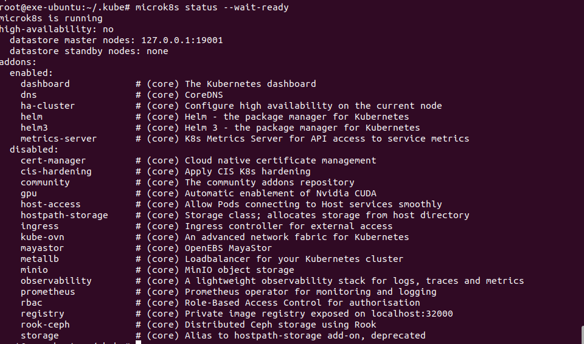
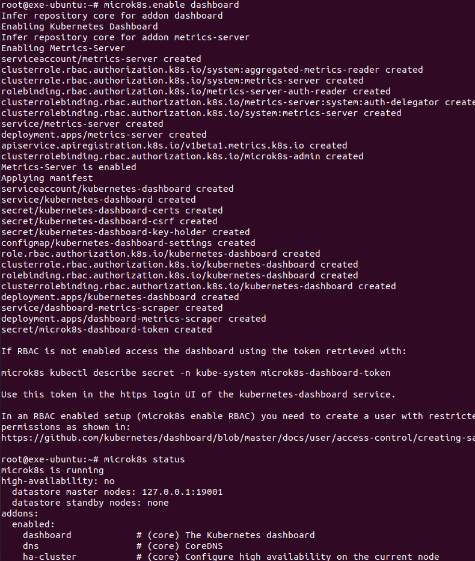
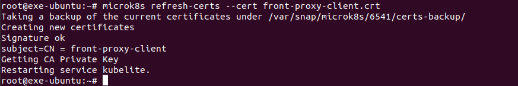
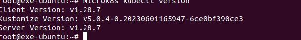
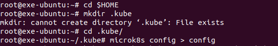
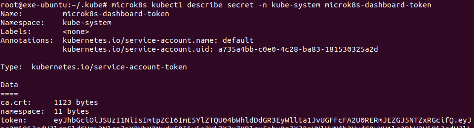
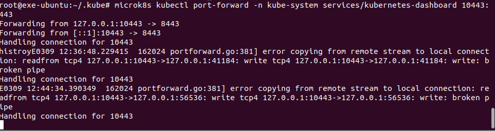
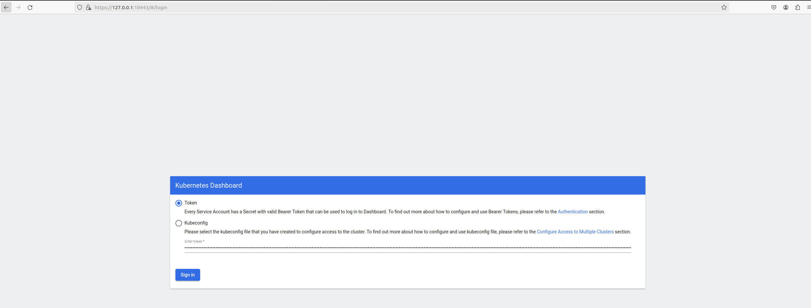
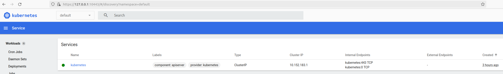

# Домашнее задание к занятию «Kubernetes. Причины появления. Команда kubectl»

### Цель задания

Для экспериментов и валидации ваших решений вам нужно подготовить тестовую среду для работы с Kubernetes. Оптимальное решение — развернуть на рабочей машине или на отдельной виртуальной машине MicroK8S.


------

<details>
  <summary>Инструкция к заданию</summary>

### Инструкция к заданию

1. Установка MicroK8S:
    - sudo apt update,
    - sudo apt install snapd,
    - sudo snap install microk8s --classic,
    - добавить локального пользователя в группу `sudo usermod -a -G microk8s $USER`,
    - изменить права на папку с конфигурацией `sudo chown -f -R $USER ~/.kube`.

2. Полезные команды:
    - проверить статус `microk8s status --wait-ready`;
    - подключиться к microK8s и получить информацию можно через команду `microk8s command`, например, `microk8s kubectl get nodes`;
    - включить addon можно через команду `microk8s enable`; 
    - список addon `microk8s status`;
    - вывод конфигурации `microk8s config`;
    - проброс порта для подключения локально `microk8s kubectl port-forward -n kube-system service/kubernetes-dashboard 10443:443`.

3. Настройка внешнего подключения:
    - отредактировать файл /var/snap/microk8s/current/certs/csr.conf.template
    ```shell
    # [ alt_names ]
    # Add
    # IP.4 = 123.45.67.89
    ```
    - обновить сертификаты `sudo microk8s refresh-certs --cert front-proxy-client.crt`.

4. Установка kubectl:
    - curl -LO https://storage.googleapis.com/kubernetes-release/release/`curl -s https://storage.googleapis.com/kubernetes-release/release/stable.txt`/bin/linux/amd64/kubectl;
    - chmod +x ./kubectl;
    - sudo mv ./kubectl /usr/local/bin/kubectl;
    - настройка автодополнения в текущую сессию `bash source <(kubectl completion bash)`;
    - добавление автодополнения в командную оболочку bash `echo "source <(kubectl completion bash)" >> ~/.bashrc`.

------

### Инструменты и дополнительные материалы, которые пригодятся для выполнения задания

1. [Инструкция](https://microk8s.io/docs/getting-started) по установке MicroK8S.
2. [Инструкция](https://kubernetes.io/ru/docs/reference/kubectl/cheatsheet/#bash) по установке автодополнения **kubectl**.
3. [Шпаргалка](https://kubernetes.io/ru/docs/reference/kubectl/cheatsheet/) по **kubectl**.

------

</details>


### Задание 1. Установка MicroK8S

1. Установить MicroK8S на локальную машину или на удалённую виртуальную машину.

Установил на локальную машину

<p align="center">
  
</p>

2. Установить dashboard.

```bash
microk8s.enable dashboard
microk8s status
```
<p align="center">
  
</p>

3. Сгенерировать сертификат для подключения к внешнему ip-адресу.

Так как используется локальная машина, то сгенерил для нее 
```bash
microk8s refresh-certs --cert front-proxy-client.crt
```
<p align="center">
  
</p>


------

### Задание 2. Установка и настройка локального kubectl
1. Установить на локальную машину kubectl.

<p align="center">
  
</p>

2. Настроить локально подключение к кластеру.

<p align="center">
  
</p>


3. Подключиться к дашборду с помощью port-forward.

Перед подключением к WEB-у генерируем токен по которому будем авторизовываться 

```bash
microk8s kubectl describe secret -n kube-system microk8s-dashboard-token
microk8s kubectl port-forward -n kube-system service/kubernetes-dashboard 10443:443
```

<p align="center">
  
</p>

<p align="center">
  
</p>

<p align="center">
  
</p>

<p align="center">
  
</p>

------
