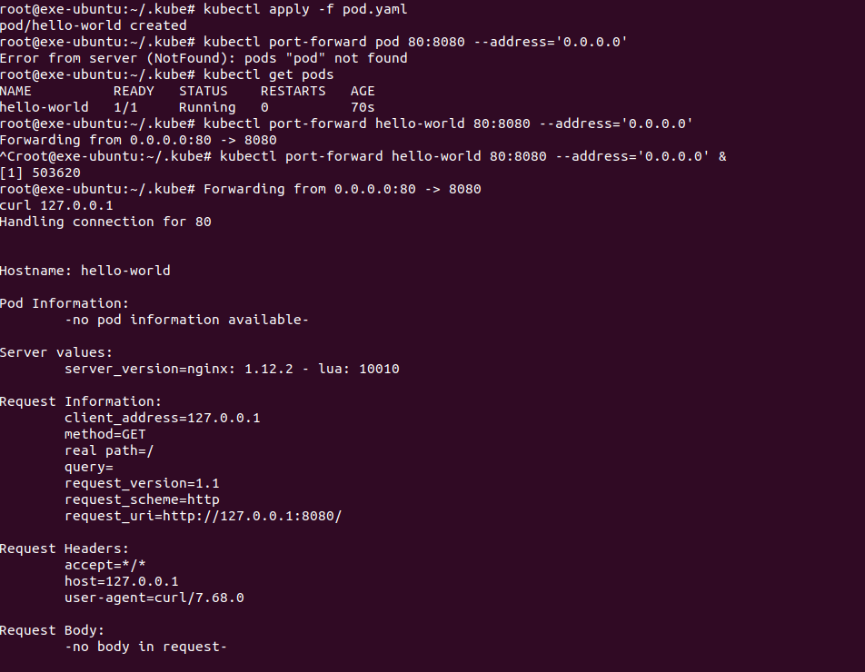
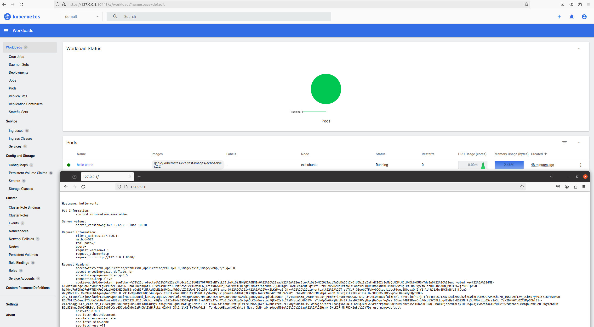
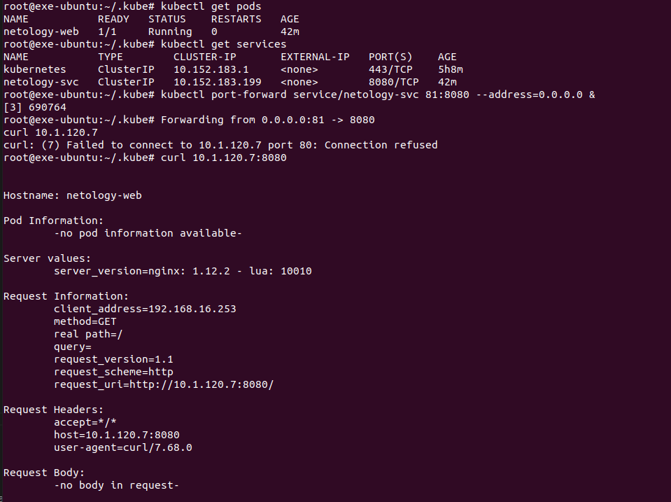

# Домашнее задание к занятию «Базовые объекты K8S»

### Цель задания

В тестовой среде для работы с Kubernetes, установленной в предыдущем ДЗ, необходимо развернуть Pod с приложением и подключиться к нему со своего локального компьютера. 

------
<details>
  <summary>Инструкция к заданию</summary>

### Чеклист готовности к домашнему заданию

1. Установленное k8s-решение (например, MicroK8S).
2. Установленный локальный kubectl.
3. Редактор YAML-файлов с подключенным Git-репозиторием.

------

### Инструменты и дополнительные материалы, которые пригодятся для выполнения задания

1. Описание [Pod](https://kubernetes.io/docs/concepts/workloads/pods/) и примеры манифестов.
2. Описание [Service](https://kubernetes.io/docs/concepts/services-networking/service/).

------

</details>


### Задание 1. Создать Pod с именем hello-world

1. Создать манифест (yaml-конфигурацию) Pod.
2. Использовать image - gcr.io/kubernetes-e2e-test-images/echoserver:2.2.
3. Подключиться локально к Pod с помощью `kubectl port-forward` и вывести значение (curl или в браузере).

------

**Ответ:**<br>

Создаем Pod по следующему манифест-файлу:<br>
```yaml

apiVersion: v1
kind: Pod
metadata:
  name: hello-world
spec:
  containers:
  - name: hello-world
    image: gcr.io/kubernetes-e2e-test-images/echoserver:2.2
    ports:
    - containerPort: 8080

```

Применяем его и проверяем поднялся ли pod, а также делаем проброс согласно требованию в задаче:<br>
```bash
kubectl apply -f pod.yaml
kubectl port-forward hello-world 80:8080 --address='0.0.0.0'
```


<p align="center">
  
</p>

<p align="center">
  
</p>


Останавливаем Pod для экономии ресурсов:<br>
```bash
kubectl delete pod hello-world
```

------

### Задание 2. Создать Service и подключить его к Pod

1. Создать Pod с именем netology-web.
2. Использовать image — gcr.io/kubernetes-e2e-test-images/echoserver:2.2.
3. Создать Service с именем netology-svc и подключить к netology-web.
4. Подключиться локально к Service с помощью `kubectl port-forward` и вывести значение (curl или в браузере).

**Ответ:**<br>

Создаем новый единый манифест-файл описывающий все требования выше:<br>

```yaml
apiVersion: v1
kind: Pod
metadata:
  name: netology-web
  labels:
    app.kubernetes.io/name: netology
spec:
  containers:
  - name: netology-web
    image: gcr.io/kubernetes-e2e-test-images/echoserver:2.2
    ports:
    - containerPort: 8080
      name: netology-port
---
apiVersion: v1
kind: Service
metadata:
  name: netology-svc
spec:
  selector:
    app.kubernetes.io/name: netology
  ports:
    - name: svc-port
      protocol: TCP
      port: 8080
      targetPort: netology-port

```

Далее проверяем запущенные поды, сервисы и делаем проброс для проверки работы:

<p align="center">
  
</p>

<p align="center">
  
</p>


Так и не понял чем был занят 80 порт с учетом что под из первой задаче был остановлен. По netstat показывало, что какой то из контейнеров. 
В самом kubectl пробовал смотреть через<br>

```bash

 kubectl get <podname> --all-namespaces -o wide 
 kubectl describe pod <podname> -n <namespace>

```

Думаю позже разберусь так как на результат текущей работы это не влияет

------

### Правила приёма работы

1. Домашняя работа оформляется в своем Git-репозитории в файле README.md. Выполненное домашнее задание пришлите ссылкой на .md-файл в вашем репозитории.
2. Файл README.md должен содержать скриншоты вывода команд `kubectl get pods`, а также скриншот результата подключения.
3. Репозиторий должен содержать файлы манифестов и ссылки на них в файле README.md.

------

### Критерии оценки
Зачёт — выполнены все задания, ответы даны в развернутой форме, приложены соответствующие скриншоты и файлы проекта, в выполненных заданиях нет противоречий и нарушения логики.

На доработку — задание выполнено частично или не выполнено, в логике выполнения заданий есть противоречия, существенные недостатки.
