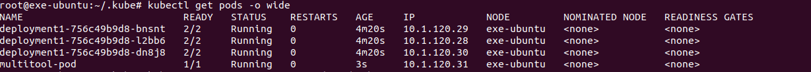
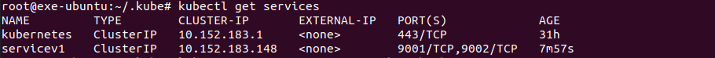
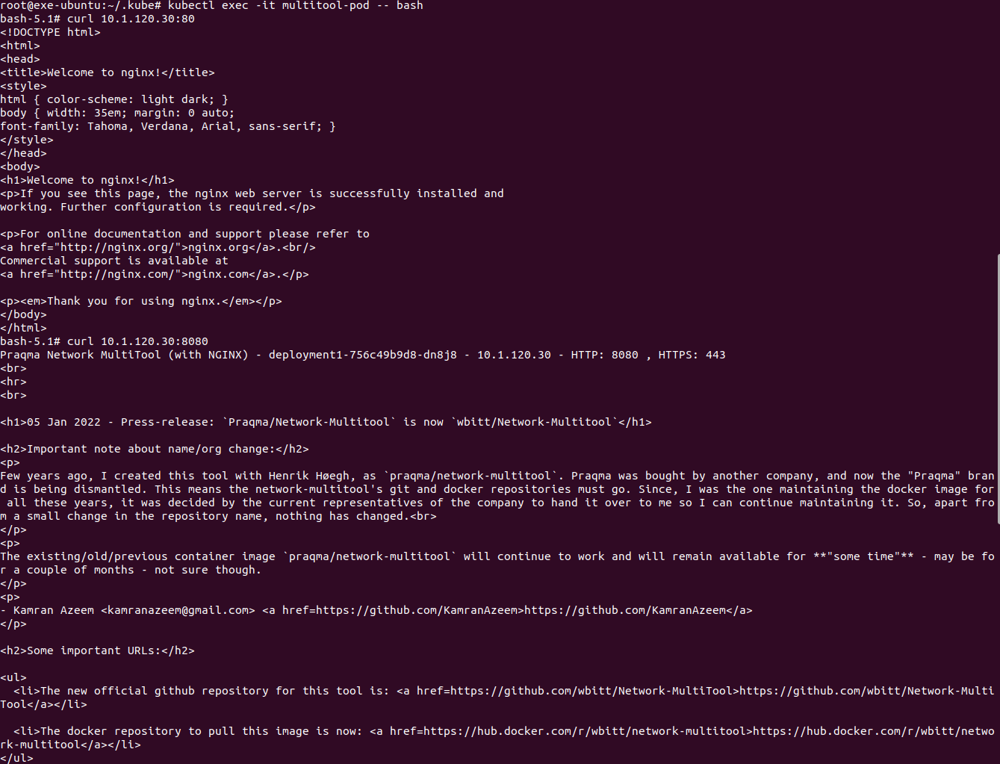
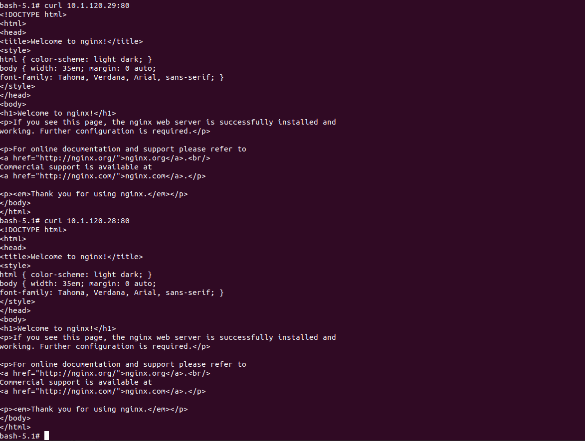
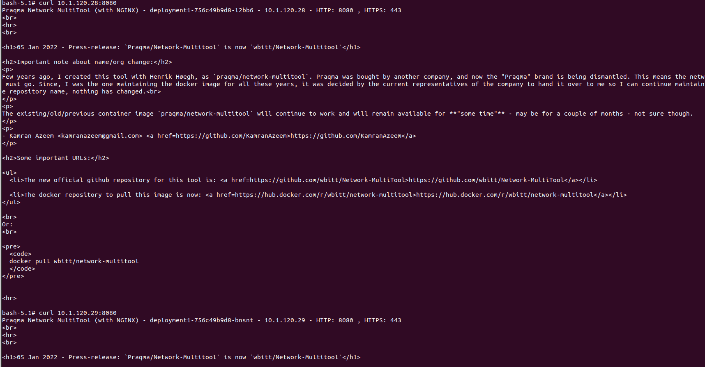
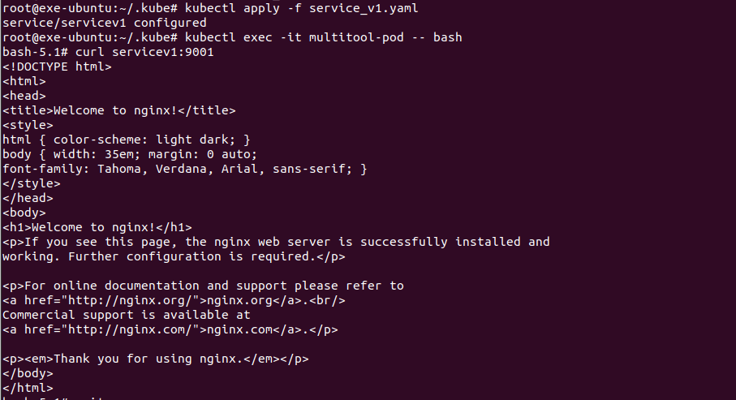
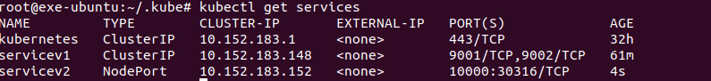
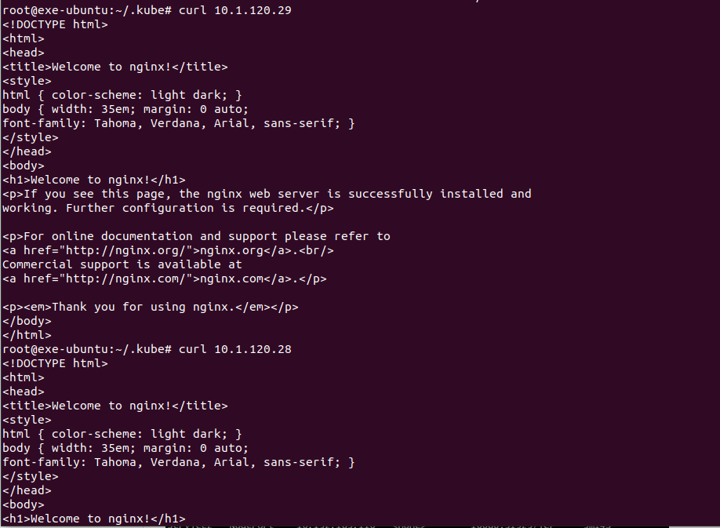

# Домашнее задание к занятию «Сетевое взаимодействие в K8S. Часть 1»

### Цель задания

В тестовой среде Kubernetes необходимо обеспечить доступ к приложению, установленному в предыдущем ДЗ и состоящему из двух контейнеров, по разным портам в разные контейнеры как внутри кластера, так и снаружи.

------
<details>
  <summary>Инструкция к заданию</summary>

### Чеклист готовности к домашнему заданию

1. Установленное k8s-решение (например, MicroK8S).
2. Установленный локальный kubectl.
3. Редактор YAML-файлов с подключённым Git-репозиторием.

------

### Инструменты и дополнительные материалы, которые пригодятся для выполнения задания

1. [Описание](https://kubernetes.io/docs/concepts/workloads/controllers/deployment/) Deployment и примеры манифестов.
2. [Описание](https://kubernetes.io/docs/concepts/services-networking/service/) Описание Service.
3. [Описание](https://github.com/wbitt/Network-MultiTool) Multitool.

</details>

------

### Задание 1. Создать Deployment и обеспечить доступ к контейнерам приложения по разным портам из другого Pod внутри кластера

1. Создать Deployment приложения, состоящего из двух контейнеров (nginx и multitool), с количеством реплик 3 шт.
2. Создать Service, который обеспечит доступ внутри кластера до контейнеров приложения из п.1 по порту 9001 — nginx 80, по 9002 — multitool 8080.
3. Создать отдельный Pod с приложением multitool и убедиться с помощью `curl`, что из пода есть доступ до приложения из п.1 по разным портам в разные контейнеры.
4. Продемонстрировать доступ с помощью `curl` по доменному имени сервиса.
5. Предоставить манифесты Deployment и Service в решении, а также скриншоты или вывод команды п.4.

------


**Ответ:**<br>

Разворачиваем pod-ы согласно описания с п.1-3

<details>
  <summary>Листинг манифестов</summary>

Cоздаем `Deployment`.<br>

```yaml

apiVersion : apps/v1
kind: Deployment
metadata:
  name: deployment1
  labels:
    app: deployment1
spec:
  replicas: 3
  selector:
    matchLabels:
      app: deployment1
  template:
    metadata:
      labels:
        app: deployment1
    spec:
      containers:
        - name: nginx
          image: nginx:latest
          ports:
            - containerPort: 80
        - name: multitool
          image: praqma/network-multitool:latest
          ports:
            - containerPort: 8080
          env:
            - name: HTTP_PORT
              value: "8080"


```

Создаем `Service`, который обеспечит доступ внутри кластера до контейнеров приложения.<br>

```yaml

apiVersion: v1
kind: Service
metadata:
  name: servicev1
spec:
  ports:
  - name: nginx
    port: 9001
    targetPort: 80
  - name: multitoolhttp
    port: 9002
    targetPort: 8080

```

Создаем `Pod` для проверки доступности до приложений.<br>

```yaml

piVersion: v1
kind: Pod
metadata:
  labels:
    app: multitool
  name: multitool-pod
  namespace: default
spec:
  containers:
  - name: multitool
    image: praqma/network-multitool
    ports:
    - containerPort: 8085


```
</details>

Проверяем что все pod-ы и services стартанули 

<p align="center">
  
</p>

<p align="center">
  
</p>

Проверяем доступность по разным ip и портам

<p align="center">
  
</p>

<p align="center">
  
</p>

<p align="center">
  
</p>

<p align="center">
  
</p>

Итоговые файлы:
[task1/deployment_v1.yaml](./deployment/service_v2.yaml) <br>
[task1/service_v1.yaml](./service/service_v2.yaml) <br>

### Задание 2. Создать Service и обеспечить доступ к приложениям снаружи кластера

1. Создать отдельный Service приложения из Задания 1 с возможностью доступа снаружи кластера к nginx, используя тип NodePort.
2. Продемонстрировать доступ с помощью браузера или `curl` с локального компьютера.
3. Предоставить манифест и Service в решении, а также скриншоты или вывод команды п.2.

------

Создаем `Service`:<br>

```yaml

apiVersion: v1
kind: Service
metadata:
  name: service2
spec:
  ports:
  - name: nginx
    port: 10000
    targetPort: 80
  type: NodePort
  selector:
    app: deployment1

```


<p align="center">
  
</p>

<p align="center">
  
</p>

Итоговый файл:<br>

[task2/service_v2.yaml](./service/service_v2.yaml) <br>


====
====
====


### Задание 1. Создать Deployment и обеспечить доступ к репликам приложения из другого Pod

1. Создать Deployment приложения, состоящего из двух контейнеров — nginx и multitool. Решить возникшую ошибку.
2. После запуска увеличить количество реплик работающего приложения до 2.
3. Продемонстрировать количество подов до и после масштабирования.
4. Создать Service, который обеспечит доступ до реплик приложений из п.1.
5. Создать отдельный Pod с приложением multitool и убедиться с помощью `curl`, что из пода есть доступ до приложений из п.1.

------

**Ответ:**<br>

Создаем `Deployment` по следующему манифест-файлу:<br>

```yaml

apiVersion : apps/v1
kind: Deployment
metadata:
  name: task-1
  labels:
    app: task-1
spec:
  selector:
    matchLabels:
      app: task-1
  template:
    metadata:
      labels:
        app: task-1
    spec:
      containers:
        - name: nginx
          image: nginx:1.20
          ports:
            - containerPort: 80
        - name: multitool
          image: wbitt/network-multitool
          env:
            - name: HTTP_PORT
              value: '8080'
            - name: HTTPS_PORT
              value: '8081'

```

Не заметил каких либо проблем при поднятие контейнеров. Вероятно, она могла заключаться в использование по дефолту одинаковых портов. Других причин не представляю.
Далее нам нужно увеличить количество реплик для этого в наш файл с `Deployment` добавляем в `spec` параметр `replicas: 2` и перекатываем все

До установки параметра `replica`
<p align="center">
  
</p>

После перекатки с параметром `replica: 2`
<p align="center">
  
</p>


Далее нам необходимо написать Service, который обеспечит доступ до реплик

```yaml

apiVersion: v1
kind: Service
metadata:
  name: service-deployment
  namespace: default
spec:
  ports:
    - name: tcp
      port: 80
      targetPort: 9000
  selector:
    app: task-1

```

Используем следующие команды:

```bash
kubectl apply -f service.yaml
kubectl get services
kubectl describe service service-deployment
```

<p align="center">
  
</p>

Поднимем Pod с приложением multitool и убедимся с помощью `curl`, что из пода есть доступ до приложений:

<p align="center">
  
</p>

<p align="center">
  
</p>


### Задание 2. Создать Deployment и обеспечить старт основного контейнера при выполнении условий

1. Создать Deployment приложения nginx и обеспечить старт контейнера только после того, как будет запущен сервис этого приложения.
2. Убедиться, что nginx не стартует. В качестве Init-контейнера взять busybox.
3. Создать и запустить Service. Убедиться, что Init запустился.
4. Продемонстрировать состояние пода до и после запуска сервиса.

------

**Ответ:**<br>

Создаем 2 новых файла. Один для `Deployment` по следующему манифест-файлу:<br>

```yaml

apiVersion: apps/v1
kind: Deployment
metadata:
  name: task-2
  labels:
    app: task-2
  namespace: default
spec:
  replicas: 1
  selector:
    matchLabels:
      app: task-2
  template:
    metadata:
      labels:
        app: task-2
      namespace: default
    spec:
      containers:
      - name: nginx
        image: nginx:1.20
        imagePullPolicy: IfNotPresent
        ports:
        - containerPort: 80
      initContainers:
      - name: init-service-deploy
        image: busybox:1.28
        command: ['sh', '-c', "until nslookup wait-nginx-start.$(cat /var/run/secrets/kubernetes.io/serviceaccount/namespace).svc.cluster.local; do echo waiting for wait-nginx-start; sleep 2; done"]


```
Второй файл будет отвечать за `Service`:

```yaml

apiVersion: v1
kind: Service
metadata:
  name: wait-nginx-start
  namespace: default
spec:
  selector:
    app: task-2
  ports:
   - protocol: TCP
     port: 80

```

Результат:
<p align="center">
  
</p>
