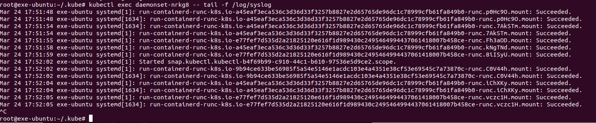

# Домашнее задание к занятию «Хранение в K8s. Часть 1»

### Цель задания

В тестовой среде Kubernetes нужно обеспечить обмен файлами между контейнерам пода и доступ к логам ноды.

------

<details>
  <summary>Инструкция к заданию</summary>

### Чеклист готовности к домашнему заданию

1. Установленное K8s-решение (например, MicroK8S).
2. Установленный локальный kubectl.
3. Редактор YAML-файлов с подключенным GitHub-репозиторием.

------

### Дополнительные материалы для выполнения задания

1. [Инструкция по установке MicroK8S](https://microk8s.io/docs/getting-started).
2. [Описание Volumes](https://kubernetes.io/docs/concepts/storage/volumes/).
3. [Описание Multitool](https://github.com/wbitt/Network-MultiTool).

</details>

------

### Задание 1 

**Что нужно сделать**

Создать Deployment приложения, состоящего из двух контейнеров и обменивающихся данными.

1. Создать Deployment приложения, состоящего из контейнеров busybox и multitool.
2. Сделать так, чтобы busybox писал каждые пять секунд в некий файл в общей директории.
3. Обеспечить возможность чтения файла контейнером multitool.
4. Продемонстрировать, что multitool может читать файл, который периодоически обновляется.
5. Предоставить манифесты Deployment в решении, а также скриншоты или вывод команды из п. 4.

------

**Ответ:**<br>

Демонстрация работы

<p align="center">
  
</p>

<details>
  <summary>Листинг</summary>

```yaml
apiVersion : apps/v1
kind: Deployment
metadata:
 name: deployment
 labels:
   app: task_1
spec:
 replicas: 1
 selector:
   matchLabels:
     app: task_1
 template:
   metadata:
     labels:
       app: task_1
   spec:
     containers:
       - name: busybox
         image: busybox
         command: ['sh', '-c', 'while true; do echo "test your homework string" >> /share/write.txt; sleep 5; done']
         volumeMounts:
         - mountPath: /share
           name: share
       - name: network-multitool
         image: praqma/network-multitool:latest
         volumeMounts:
         - mountPath: /share
           name: share
         env:
         - name: HTTP_PORT
           value: "80"
         - name: HTTPS_PORT
           value: "443"
         ports:
         - containerPort: 80
           name: http-port
         - containerPort: 443
           name: https-port
     volumes:
     - name: share
       emptyDir: {}


```
</details>

Манифест файл:<br>

[Deployment.yml](./task1/deployment.yml)<br>


### Задание 2

**Что нужно сделать**

Создать DaemonSet приложения, которое может прочитать логи ноды.

1. Создать DaemonSet приложения, состоящего из multitool.
2. Обеспечить возможность чтения файла `/var/log/syslog` кластера MicroK8S.
3. Продемонстрировать возможность чтения файла изнутри пода.
4. Предоставить манифесты Deployment, а также скриншоты или вывод команды из п. 2.

------

**Ответ:**<br>

Демонстрация работы

<p align="center">
  
</p>

<details>
  <summary>Листинг</summary>

```yaml
apiVersion: apps/v1
kind: DaemonSet
metadata:
  name: daemonset
  labels:
    app: task_2
spec:
  selector:
    matchLabels:
      app: task_2
  template:
    metadata:
      labels:
        app: task_2
    spec:
      containers:
      - name: network-multitool
        image: praqma/network-multitool:latest
        volumeMounts:
        - name: node-volume
          mountPath: /log/syslog
        env:
        - name: HTTP_PORT
          value: "80"
        - name: HTTPS_PORT
          value: "443"
        ports:
        - containerPort: 80
          name: http-port
        - containerPort: 443
          name: https-port
      volumes:
      - name: node-volume
        hostPath:
          path: /var/log/syslog

```

</details>

Манифест файл:<br>

[DaemonSet.yml](./task2/daemonset.yml)<br>


# Домашнее задание к занятию «Сетевое взаимодействие в K8S. Часть 2»

### Цель задания

В тестовой среде Kubernetes необходимо обеспечить доступ к двум приложениям снаружи кластера по разным путям.

------
<details>
  <summary>Инструкция к заданию</summary>
### Чеклист готовности к домашнему заданию

1. Установленное k8s-решение (например, MicroK8S).
2. Установленный локальный kubectl.
3. Редактор YAML-файлов с подключённым Git-репозиторием.

------

### Инструменты и дополнительные материалы, которые пригодятся для выполнения задания

1. [Инструкция](https://microk8s.io/docs/getting-started) по установке MicroK8S.
2. [Описание](https://kubernetes.io/docs/concepts/services-networking/service/) Service.
3. [Описание](https://kubernetes.io/docs/concepts/services-networking/ingress/) Ingress.
4. [Описание](https://github.com/wbitt/Network-MultiTool) Multitool.


</details>

------

### Задание 1. Создать Deployment приложений backend и frontend

1. Создать Deployment приложения _frontend_ из образа nginx с количеством реплик 3 шт.
2. Создать Deployment приложения _backend_ из образа multitool. 
3. Добавить Service, которые обеспечат доступ к обоим приложениям внутри кластера. 
4. Продемонстрировать, что приложения видят друг друга с помощью Service.
5. Предоставить манифесты Deployment и Service в решении, а также скриншоты или вывод команды п.4.

------

**Ответ:**<br>

Созданные манифесты из п.1 п.2 п.3

Итоговые файлы:<br>

[task1/frontend.yml](./task1/front.yml)<br>
[task1/backend.yml](./task1/back.yml)<br>
[task1/service.yml](./task1/service.yml)<br>

Подготовка подов, сервисов.

<p align="center">
  
</p>

Проверка доступов внутри кластера:

<p align="center">
  
</p>

<p align="center">
  
</p>

Доступы есть.


### Задание 2. Создать Ingress и обеспечить доступ к приложениям снаружи кластера

1. Включить Ingress-controller в MicroK8S.
2. Создать Ingress, обеспечивающий доступ снаружи по IP-адресу кластера MicroK8S так, чтобы при запросе только по адресу открывался _frontend_ а при добавлении /api - _backend_.
3. Продемонстрировать доступ с помощью браузера или `curl` с локального компьютера.
4. Предоставить манифесты и скриншоты или вывод команды п.2.

------

**Ответ:**<br>

Итоговые файлы:<br>

[task2/ingress.yml](./task2/ingress.yml)<br>


Включаем Ingress-controller в MicroK8S

```bash

root@exe-ubuntu:~/.kube# microk8s enable ingress
Infer repository core for addon ingress
Enabling Ingress
ingressclass.networking.k8s.io/public created
ingressclass.networking.k8s.io/nginx created
namespace/ingress created
serviceaccount/nginx-ingress-microk8s-serviceaccount created
clusterrole.rbac.authorization.k8s.io/nginx-ingress-microk8s-clusterrole created
role.rbac.authorization.k8s.io/nginx-ingress-microk8s-role created
clusterrolebinding.rbac.authorization.k8s.io/nginx-ingress-microk8s created
rolebinding.rbac.authorization.k8s.io/nginx-ingress-microk8s created
configmap/nginx-load-balancer-microk8s-conf created
configmap/nginx-ingress-tcp-microk8s-conf created
configmap/nginx-ingress-udp-microk8s-conf created
daemonset.apps/nginx-ingress-microk8s-controller created
Ingress is enabled

```


После применения манифеста проверяем статус Ingress правила:

<p align="center">
  
</p>


Проверяем доступ с помощью браузера:

<p align="center">
  
</p>

<p align="center">
  
</p>


