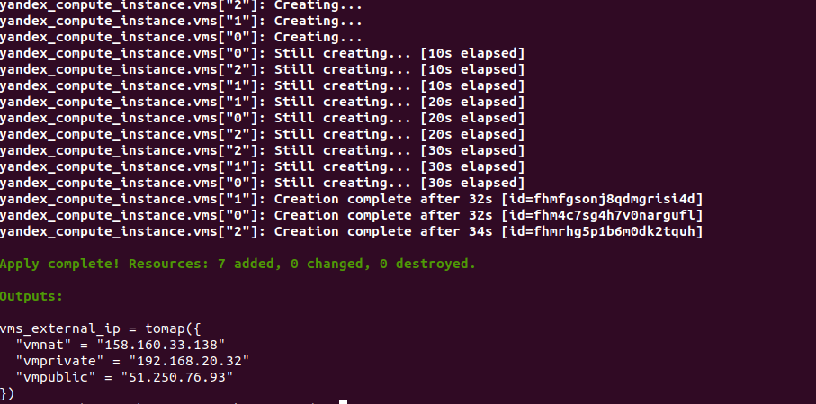
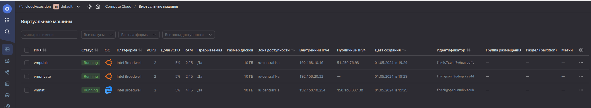
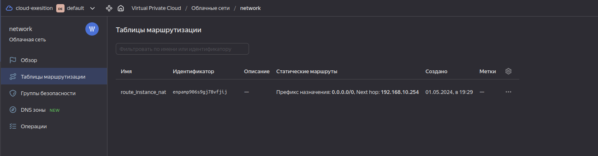
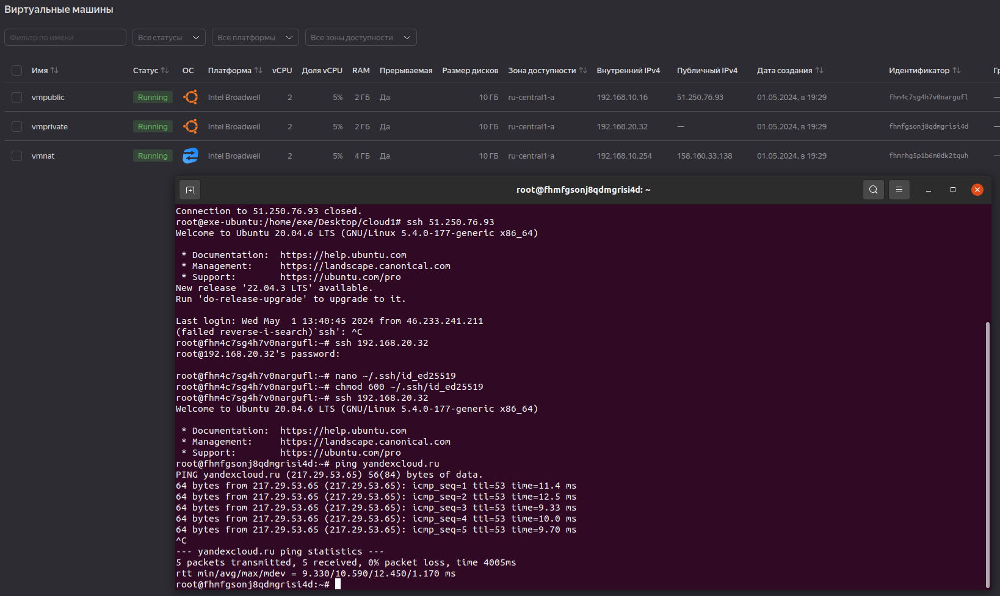
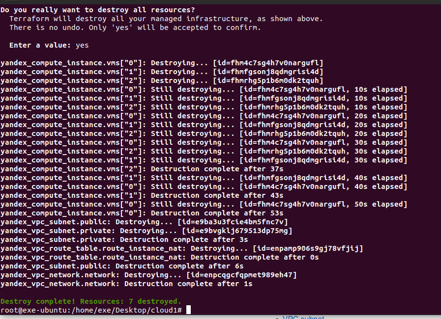

# Домашнее задание к занятию «Организация сети»

### Подготовка к выполнению задания

1. Домашнее задание состоит из обязательной части, которую нужно выполнить на провайдере Yandex Cloud, и дополнительной части в AWS (выполняется по желанию). 
2. Все домашние задания в блоке 15 связаны друг с другом и в конце представляют пример законченной инфраструктуры.  
3. Все задания нужно выполнить с помощью Terraform. Результатом выполненного домашнего задания будет код в репозитории. 
4. Перед началом работы настройте доступ к облачным ресурсам из Terraform, используя материалы прошлых лекций и домашнее задание по теме «Облачные провайдеры и синтаксис Terraform». Заранее выберите регион (в случае AWS) и зону.

---
### Задание 1. Yandex Cloud 

**Что нужно сделать**

1. Создать пустую VPC. Выбрать зону.
2. Публичная подсеть.

 - Создать в VPC subnet с названием public, сетью 192.168.10.0/24.
 - Создать в этой подсети NAT-инстанс, присвоив ему адрес 192.168.10.254. В качестве image_id использовать fd80mrhj8fl2oe87o4e1.
 - Создать в этой публичной подсети виртуалку с публичным IP, подключиться к ней и убедиться, что есть доступ к интернету.
3. Приватная подсеть.
 - Создать в VPC subnet с названием private, сетью 192.168.20.0/24.
 - Создать route table. Добавить статический маршрут, направляющий весь исходящий трафик private сети в NAT-инстанс.
 - Создать в этой приватной подсети виртуалку с внутренним IP, подключиться к ней через виртуалку, созданную ранее, и убедиться, что есть доступ к интернету.

------

**Ответ:** 

Подготовим manifest для развертывания всей необходимой инфраструктуры:

[main.tf](src/main.tf) 
[network.tf](src/network.tf) 
[variables.tf](src/variables.tf) 
[locals.tf](src/locals.tf) 
[output.tf](src/output.tf) 
[providers.tf](src/providers.tf) 

Деплой инфраструктуры:

  

  

ВМ созданые далее проверяем, как настроились сети:

  

  

Сетевое окружение настроено теперь проверяем подключение к интернету на VM в частной сети через назначенную статику:

  

Работает!

После всех работ не забываем удалить проект 

  

