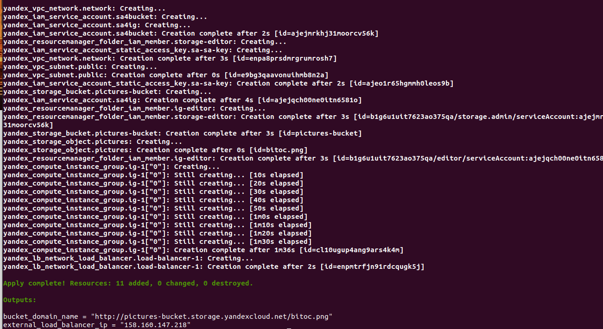
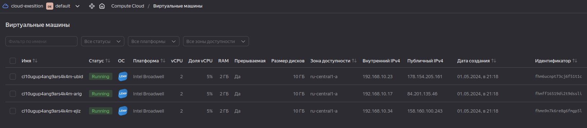
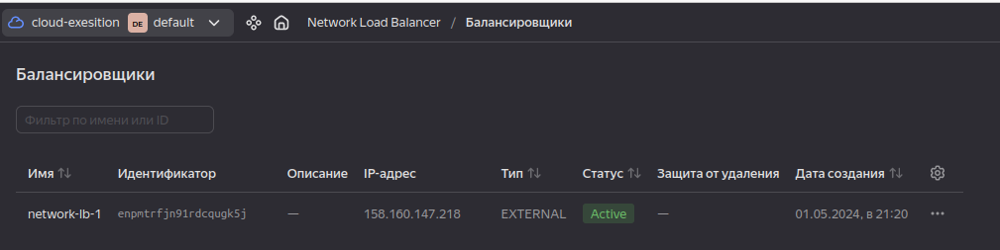
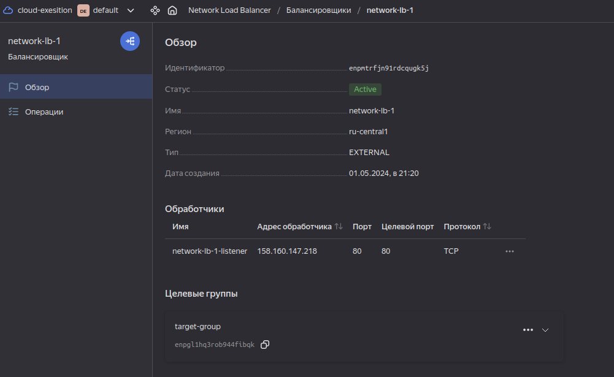
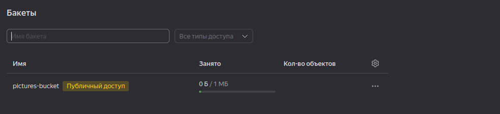
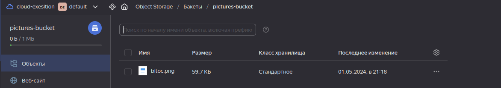
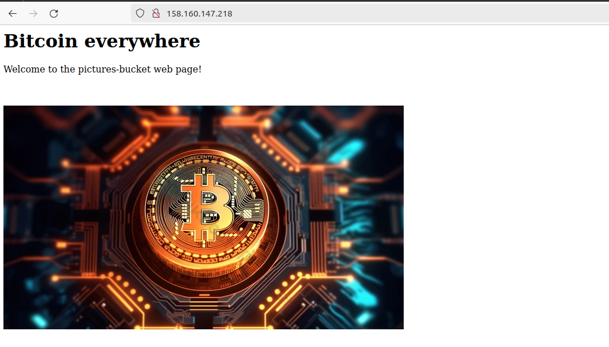
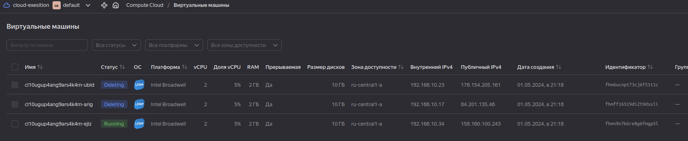
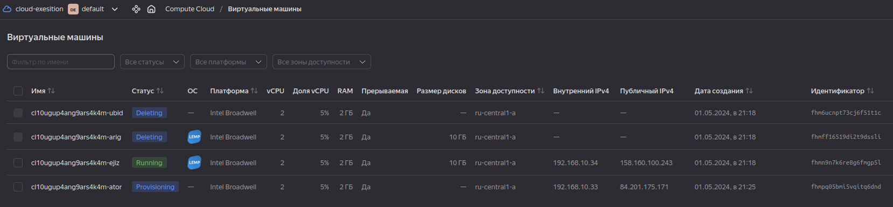
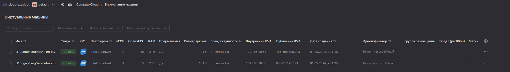

# Домашнее задание к занятию «Вычислительные мощности. Балансировщики нагрузки»  

## Задание 1. Yandex Cloud 

**Что нужно сделать**

1. Создать бакет Object Storage и разместить в нём файл с картинкой:

 - Создать бакет в Object Storage с произвольным именем (например, _имя_студента_дата_).
 - Положить в бакет файл с картинкой.
 - Сделать файл доступным из интернета.
 
2. Создать группу ВМ в public подсети фиксированного размера с шаблоном LAMP и веб-страницей, содержащей ссылку на картинку из бакета:

 - Создать Instance Group с тремя ВМ и шаблоном LAMP. Для LAMP рекомендуется использовать `image_id = fd827b91d99psvq5fjit`.
 - Для создания стартовой веб-страницы рекомендуется использовать раздел `user_data` в [meta_data](https://cloud.yandex.ru/docs/compute/concepts/vm-metadata).
 - Разместить в стартовой веб-странице шаблонной ВМ ссылку на картинку из бакета.
 - Настроить проверку состояния ВМ.
 
3. Подключить группу к сетевому балансировщику:

 - Создать сетевой балансировщик.
 - Проверить работоспособность, удалив одну или несколько ВМ.

------

**Ответ:** 

Подготовим manifest для развертывания всей необходимой инфраструктуры:

[nlb.tf](src/nlb.tf)
[ig.tf](src/ig.tf)
[bucket.tf](src/bucket.tf)
[sa.tf](src/sa.tf)
[main.tf](src/main.tf)
[network.tf](src/network.tf)
[variables.tf](src/variables.tf)
[locals.tf](src/locals.tf)
[output.tf](src/output.tf)
[providers.tf](src/providers.tf)

Деплой инфраструктуры:

terraform apply:

  

В выводе outputs получаем ip по которому будем проверять web-страницу с картинкой в бакете. У нас это `156.160.147.218`

Проверяем факт создания ВМ, Bucket, Load балансера:

**VM**

  

**Load Balancer**

  

  

**Bucket + Bucket object**

  

  

Все необходимые сущности созданы. Теперь можно проверить работу web-страницы:

  

Работает!

Пробуем удалить несколько ВМ из пула и во время процедуры проверяем не повлиялоли ли это на работу web-страницы:

**Ручное удаление VM**

  

**Автоматическое восстановление VM в пуле**

  

**Итоговое состояние**

  

С момента удаления до конечной точки восстановления количества ВМ до двух перебоев в работе сервиса не наблюдал

Web-страница продолжает работать...

  

