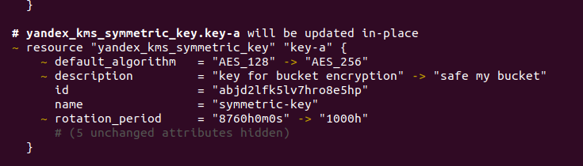
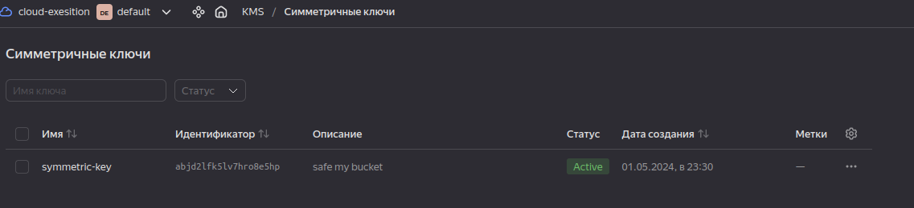
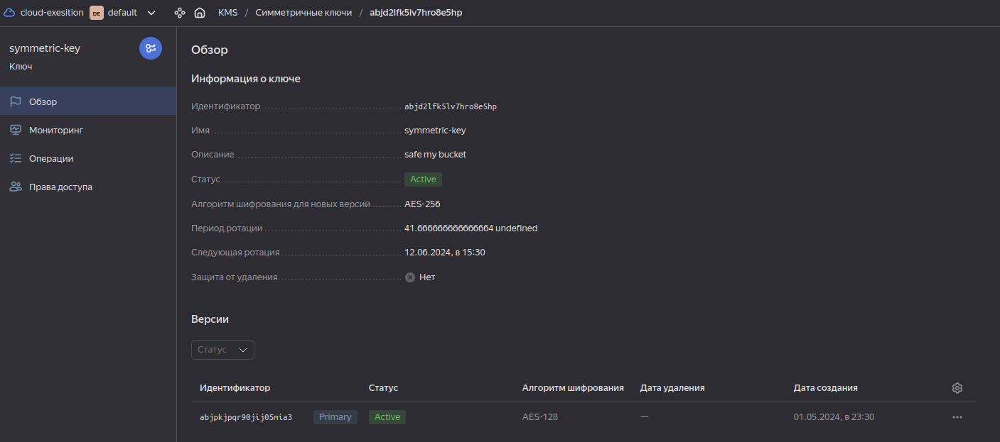
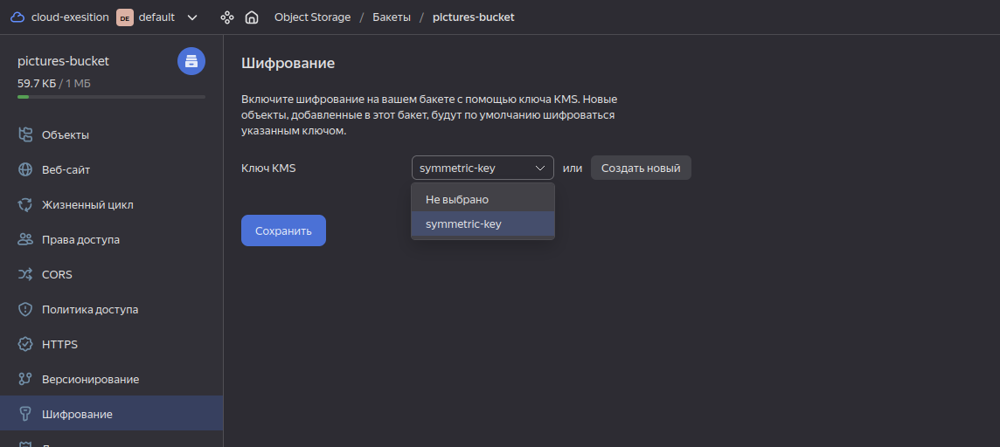

# Домашнее задание к занятию «Безопасность в облачных провайдерах»  

Используя конфигурации, выполненные в рамках предыдущих домашних заданий, нужно добавить возможность шифрования бакета.

---
## Задание 1. Yandex Cloud   

1. С помощью ключа в KMS необходимо зашифровать содержимое бакета:

 - создать ключ в KMS;
 - с помощью ключа зашифровать содержимое бакета, созданного ранее.

2. (Выполняется не в Terraform)* Создать статический сайт в Object Storage c собственным публичным адресом и сделать доступным по HTTPS:

 - создать сертификат;
 - создать статическую страницу в Object Storage и применить сертификат HTTPS;
 - в качестве результата предоставить скриншот на страницу с сертификатом в заголовке (замочек).

------

**Ответ:**<br>
Сделал только основное задание п.1
Необходимо изменить правило создания bucket для этого вносим изменения в ранее созданный файл:

[bucket.tf](https://github.com/exesition/devops-netology-hw/blob/main/15-clopro-02-nlb/src/bucket.tf)<br>

<details>
  <summary>Листинг кода</summary>


```h

// Create Static Access Keys
resource "yandex_iam_service_account_static_access_key" "sa-static-key" {
  service_account_id = yandex_iam_service_account.sa4bucket.id
  description        = "static access key for object storage"
}

resource "yandex_kms_symmetric_key" "key-a" {
  name              = "symmetric-key"
  description       = "safe my bucket"
  default_algorithm = "AES_256"
  rotation_period   = "1000h"
}


// Use keys to create bucket
resource "yandex_storage_bucket" "pictures-bucket" {
  depends_on = [yandex_iam_service_account.sa4bucket]
  access_key = yandex_iam_service_account_static_access_key.sa-sa-key.access_key
  secret_key = yandex_iam_service_account_static_access_key.sa-sa-key.secret_key
  bucket     = "pictures-bucket"
  acl        = "public-read"
  max_size   = 1048576

  server_side_encryption_configuration {
    rule {
      apply_server_side_encryption_by_default {
        kms_master_key_id = yandex_kms_symmetric_key.key-a.id
        sse_algorithm     = "aws:kms" //required field
      }
    }
  }
}


resource "yandex_storage_object" "pictures" {
  depends_on = [yandex_iam_service_account.sa4bucket]
  access_key = yandex_iam_service_account_static_access_key.sa-sa-key.access_key
  secret_key = yandex_iam_service_account_static_access_key.sa-sa-key.secret_key
  bucket     = yandex_storage_bucket.pictures-bucket.bucket
  key        = "bitoc.png"
  source     = "../bitoc.png"
  acl        = "public-read"
}

```

</details>

Делаем передеплой инфраструктуры и видим, что ключ должен будет создаваться автоматически :


<p align="center">
  
</p>


<p align="center">
  
</p>


<p align="center">
  
</p>


<p align="center">
  
</p>

Конечный файл с учетом изменений:<br>
[bucket.tf](./src/bucket.tf)<br>
